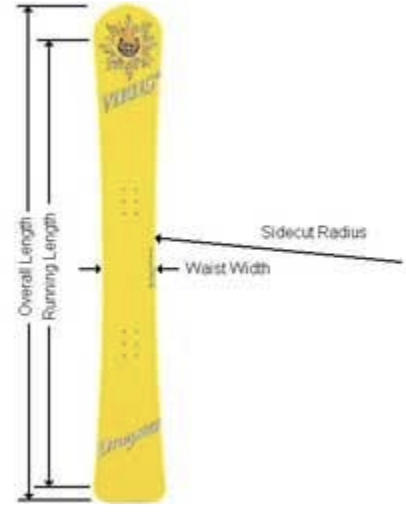
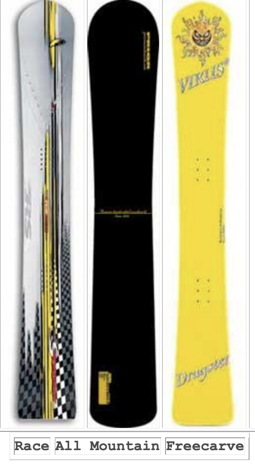

# How to Buy an Alpine Snowboard

By Jack Michaud

*NOTE: A lot has happened in the hard boot world since this article was
written, but a lot of the concepts listed here are basic concepts that
are true for every hard boot board. Please see this article on the
updates to the technology in the world of hard boot snowboarding.
The last tried and true method of buying skis
before the whole shaped-ski revolution was to
buy the pair that reached to your wrist when
you raised your arm straight above your head.
But there never has been such a rule for
snowboards. That's because accomplished carvers
can use just about any board within a 40-
centimeter range or more, and enjoy them all
for different purposes. If you're new to buying
alpine snowboards, or if you need some ideas
for your next deck, consider these guidelines:*

## 1. Length

The length of your alpine snowboard generally
determines three things: maneuverability (i.e.,
how easy it is to not carve it), stability at speed, and edge hold.
The longer the board is, the more difficult it is to quickly change
direction. This is almost a non-issue when carving, because we are not
trying to steer or force the board to change direction. However, this
is a significant issue when not carving, which is what you will be
doing a good deal of while learning, or riding un-groomed terrain. If
you are new to alpine boards, a deck that stands somewhere between
your chin and your nose will be a good start. The shorter a board is,
the less stable it will be at higher speeds. This is also due to the
fact that sidecut radii generally decrease and increase with board
size. A shorter radius wants to turn more, but we'll cover that below.
Longer boards are more stable at speed for many reasons. By their
sheer length and weight, they are generally more damp, meaning they
resist vibration. They won't be unsettled as easily by sudden changes
in the quality or smoothness of the snow surface. If the impact of
such changes can be spread out over a longer length, the result is
less disturbance to the overall system. Other vehicles that gain
stability with length include skateboards, surfboards, sailboards,
motorcycles, and boats, to name a few.

Edge hold relies largely on stability, which is why longer boards have
more of it, and why snowboard and ski racers alike use quite long
boards for higher speed events such as Giant Slalom and up. The
physics of edge hold is a somewhat complicated matter that doesn't
need to be discussed in depth here. It is true that at one extreme, an
"edge" shrunken to a single point will have ultimate holding power,
which is why ice-climbers use ice axes and crampons. But you'll never
see ski racers using snow-blades, nor snowboard racers using 150's in
a GS course. There's a lot to be said for stability when it comes to
edge hold, but while learning you won't be going fast enough to need a
very long board.
Most manufacturers list a "running length" and sometimes "effective
edge length" in addition to overall length. Running length is the
overall length minus the length of the upturned nose and tail. Boards
that are intended for the same purpose like racing, freecarving or
all-mountain carving usually have quite similar ratios of overall
length to running length. Boards with less running length will be
easier to handle off the groomed path, but sacrifice a little edge
grip. Effective edge length is really a useless number as it is the
actual length of the edge, measured along the curve of the sidecut.
Two boards with the same running length but different sidecut radius
will have different effective edge length, but who cares?

## 2. Sidecut Radius

First of all, "radius" is the term for the distance from the center of
a circle to its edge. The sidecut is a curve cut into the side of the
board that is part of a big circle with a certain radius. Some boards
have a slightly different sidecut shape, like a parabola, an ellipse,
a blend of two or more radii, or some other curve. For convenience and
comparability, all descriptions of sidecuts refer to a radius, or
equivalent radius, measured in meters.

When carving, the shape of our turns resemble half-circles sliced into
the snow. Without sidecut, we would simply rail right into the woods,
in a straight line. As we tilt the board up on edge, the sidecut
allows it to bend into an arc that describes the shape of the carve.
The higher the edge angle, the more the board bends, and the tighter
the carve becomes. The sidecut radius is the measurement of the curve
in the side of the board when the board is flat on the ground.
Therefore, this number is actually slightly larger than the largest
radius turn the board will carve. By "carve" we mean a turn where the
entire edge slices cleanly through the same track in the snow without
any sideways sliding.

Speed and turn radius share an inverse relationship. That is, the
faster you go, the tighter you will be able to carve a given sidecut,
to a point. Two boards with different sidecut radii can carve the same
size turn, but the board with the longer radius will have to do it at
a higher speed. As with snowboard length, larger sidecuts will be more
stable at higher speeds, but less usable in tight spaces or crowds. In
fact, large radii are not even carvable at slower speeds. Small radii
will oscillate or chatter if ridden beyond their speed envelope.

Radii in the range of 8 to 11 meters, depending on your physical size,
are usually used for slalom racing, shorter turns, and slower speeds.
This is a good range for a first alpine board because you will be able
to carve the board at speeds within your comfort zone. Consider also
the width of the trails you usually ride, and the crowds you have to
navigate.

## 3. Waist Width

The waist width is measured straight across the board at its narrowest
point, usually in millimeters. The narrower the board, the quicker it
will be from edge to edge, and it will feel more lively. The wider the
board, the easier it will be to ride on varied terrain, and it will
feel more relaxed between carves. When going from a wider board to a
narrower board, you may feel like the narrower board is less stable,
but you will soon get used to it. Waist width is a personal taste;
some professional racers won't touch anything skinnier than a 200mm
wide board, others no wider than 180mm.

For advanced carvers, stance angles in the neighborhood of 57-63
degrees have become the norm. For beginners, it will be easier to make
the transition from softboot angles if you can stay around 50-55
degrees. If you've been carving it up well on your soft gear, you may
be able to jump right into a more aggressive stance.

Your boot size and the waist width determine your stance angle. The
proper angles to use are those at which your toes and heels are as
close to the edges of the board without hanging over. As a beginner
you will be able to get away with a little more overhang because you
probably won't be tilting the board up that high. As you progress, you
will need to angle your bindings more to avoid boot drag. Choose a
board with a waist width that will accommodate your boot size at a
desirable angle.

## 4. Stiffness

Unfortunately there is no universal measurement for board stiffness
like there is for sidecut, yet. After you've owned and experienced
three or so boards, you'll be able to flex boards by hand and get an
idea of their stiffness characteristics. Ideally, you want a board's
stiffness to be matched to your weight and how fast you intend to ride
it.

Higher speeds generate higher g-forces, and the board needs to be
stiff enough to balance them. A board that is too soft for your weight
and/or your speed will fold up and loose the carve. A board that is
too stiff will feel unwilling to carve and will be more difficult to
ride. Fortunately snowboard manufacturers have identified what size
people usually ride what size boards. Also, the range of acceptable
stiffness is not that narrow.
Some boutique manufacturers can adjust the flex of a stock board to
your weight without extra charge. Or, if you want to pay for a full
custom, you can have a board built exactly to your every
specification. However it is very likely that you will be able to pick
a board off the shelf that will work very well for you.

## 5. Taper

Taper is the difference between the nose width and tail width, when
the tail is slightly narrower than the nose. Some boards have it and
some have none. A few even have reverse taper. The purpose of taper is
to make the tail of the board release from the carve easier. To have
taper or not is really a matter of taste. Some feel that it helps make
a board quicker from edge to edge. Some people would describe the
finish of a carve made by a board without taper as "hooky", while
others would say it is more positive and defined. Many all-mountain
carving boards have taper to make skidded turns, varied terrain, and
powder easier to deal with. If you've found a board that you think is
the right length, width, and sidecut radius, don't worry about taper,
just buy the board, you probably won't even notice. The only way to
tell if you want a board with taper or not is to ride one.

## 6. Different Types of Alpine Boards

Alpine snowboards have evolved into three basic shapes: all-mountain,
freecarve, and race. (sometimes the terms all-mountain and freecarve
are used synonymously) Wolves in sheep's clothing, all-mountain
carving boards put enough running length on the ground and are stiff
enough to really nail solid carves. But they also have longer, rounded
noses and tails, and wider widths to be useful and very fun all over
the mountain, including powder, bumps, and off-piste. They can be
ridden with hardboots or softboots if you can fit your softboots on
the board at realistic angles. If you like to put the smack down on
the corduroy, and chase your softbooter friends all over the mountain,
this is the board to get if you can only own one board. These are also
excellent boards for beginner or casual carvers, and cross-over
skiers, as they are the most forgiving of all carving boards. The
round tail will do whatever you want, it doesn't always try to lock
into a carve. Cross-over skiers will enjoy these boards because you
can jump on one with your ski boots on your first day of snowboarding
ever, and stay with it as long as you like. Being able to switch from
skis to board mid-day or vice versa is ultra convenient, and keeps
everything fresh.

Freecarve snowboards are nearly race-shaped decks with slightly softer
flex, and maybe a little extra width, and nose/tail length. They also
usually have a tighter sidecut radius than a race board of the same
length, so they will carve at lower speeds. They're designed to be
more forgiving, easier to learn to ride, and a bit easier to ride on
varied terrain. These are good choices for people who want to get into
carving and can afford two whole setups. They're also good for lighter
weight riders and people not interested in racing or blistering
speeds.

Race boards are replicas of the boards used by professional racers,
designed for ultimate speed and edge hold. But that doesn't mean you
have to be a racer to use them. These are the boards you aspire to
mastering as you realize your own carving potential. They have minimal
noses and tails, and are the stiffest boards available. On good
conditions, a properly sized race board will take all you can dish
out. On icy conditions, they will offer the most edge hold of any
board, but it's still up to you to deal with ice. Once you have been
bitten by the race board bug, you will find yourself lusting after all
sizes of race boards, from short boards that barely come up to your
armpits for maximum flickability, to long boards that stand taller
than your head for pulling high speed g's on wide open corduroy. Just
try not to tap into your retirement fund buying them all.
