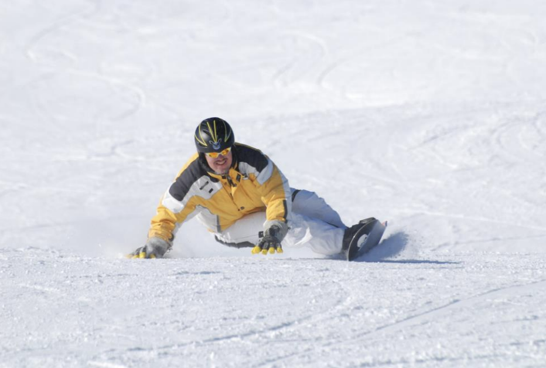
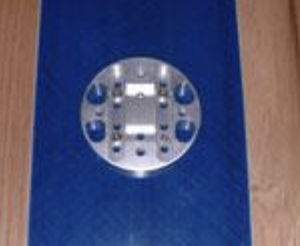
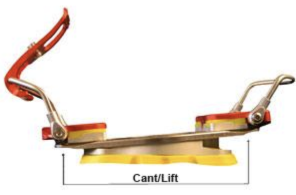
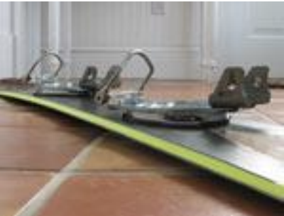
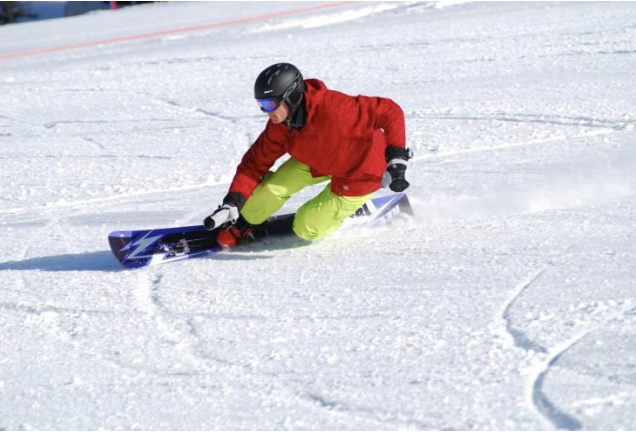

# Canting and Lift

By Jack Michaud

Photos courtesy of Chris Chabot

Canting. Sounds technical doesn't it? Like you have to have worn either a speed suit or an
instructor's uniform before you're allowed to use the word. The truth is that canting is a fairly
old concept that is actually simple to understand, yet can be very dramatic in its effects.
Canting's role in snowboarding has gone through an evolution, with freestylers, freecarvers,
racers, and freeriders alike. Similar to the theory of asymmetry, the theory of canting has changed
as snowboarders have changed the standards of riding.

What exactly is canting? Canting is the lateral, or side-to-side tilting of your boot or binding.
Canting can be achieved by adjusting your bindings, or if your bindings are not adjustable, with an
aftermarket device. These typically consist of a sloped platform, or wedge that you mount to your
board underneath your binding. Lifting the toe or heel of the boot is technically not canting, that
is simply called "heel lift" or "toe lift". However often the concept of toe and heel lift is
lumped in with the term "canting".

Cants came about when people looked to the world of skiing for a way to improve the comfort and
effectiveness of their riding. Racers originally used cants to help center their body between their
feet and to help make riding in hardshell boots more natural. Freestylers also briefly experimented
with cants. It is important to note that the concept of canting was born in the days when carvers
stood more across the board; they needed something to make facing forward more comfortable.

The next step in the evolution of canting came when alpine riders started riding with steeper
binding angles and asymmetric Alpine boards became the new technological must-have. While the
angles got steeper, the cants stayed the same. This presented a new problem, where the cants that
used to slope towards the middle of the board were now sloping significantly towards the side of
the board as well. Would-be carvers back knees were awkwardly and unstably locked into the back of
their front knees, forcing the rise of a host of brand new bad carving habits.

Next, with the advent of 360 degree freedom of binding angle adjustment, cants
became a wedge shaped device that sloped only along the long axis of the
snowboard. These were a vast improvement since no canting went towards the side
of the board anymore. By this time, freestylers had abandoned cants for the
close-to-the-board feel. The image ~~to the right~~ below is a 3 degree cant disc from a
Bomber TD1. It slopes only along the long axis of the board. Depending on your binding angle, you
got a blend of toe or heel lift and inward cant.

The latest theory in the school of binding tilting goes hand in hand with the newer symmetrical
carving technique, and it just may help you get over that hump or plateau in your alpine abilities.
Much like symmetrical carving boards, this technique may be beneficial to anyone riding with angles
greater than 45 or 50 degrees.

If you've only been riding with a cant that slopes along
the long axis of the board, you should definitely try a
new setup. You will probably find a different arrangement
that allows your lower body greater range of motion, and
greater comfort. Many bindings these days, such as the
Bomber TD3, allow for a wide range of cant and lift
adjustment. Is your head spinning yet? Don't know where to
start? Try this new setup and see what you think. It is a
good baseline from which to explore.

Start with a toe lift for the front foot, a heel lift for
the back foot, and no canting. A good middle-ground place
to start is with 3 degrees of toe and heel lift. The image
below shows a pair of Bomber TD2 bindings mounted with the
3 degree cant/lift discs providing toe lift on the front foot and heel lift on the back foot. (the
nose of the board in the picture is pointing away from the camera, and it is a goofy stance)

If you want to take it one step further, you can add a
slight outward cant to the back foot - outward meaning towards the
toeside edge. But, before you start messing with cants, make sure
your bindings are angled properly. The bindings should be mounted
such that no part of your boots or bindings protrude past the edge of
the board when you view the board on the floor from above.

How does this setup work? The toe lift under the front foot helps to
compensate for the forward lean built into all hardboots. Forward
lean in a boot is good because it is natural for your ankle to bend
that way when your knees bend. But if you ride without a lift, that
forward lean causes a situation where both your legs are tilting
forward, and your whole lower body is cocked awkwardly out towards
the nose of the board. Many people find this uncomfortable. The toe lift brings you back to a more
natural, comfortable position and your knees are more able to naturally adjust to variations in the
terrain.

The heel lift on the back foot works with the toe lift to augment the effect. Together, heel lift
and toe lift enables you to comfortably use a wider stance, which markedly improves balance,
stability, mobility, and increases the effects of fore and aft weight adjustments throughout a
carve.

Some people prefer using a flat stance, and believe that it doesn't matter that it feels awkward
when you're standing up on your board in your living room. That is because when you're carving, the
board bends and the stance becomes more natural. This is true, however between carves the board
goes flat at precisely the moment you need maximum agility to flick the board from edge to edge.
There are plenty of other times when our boards are flat on the ground too. We do not carve 100% of
the day. It is important to be comfortable on your board at all times so that you do not fatigue
early, and so you are loose, relaxed, and ready to make your next carve. Here at Bomber, we feel
that you should be able to stand in your boots and in a neutral stance on your board for a good 20-
30 minutes. IF you’re comfortable while carpet carving, you’ll most likely be comfortable on the
hill.

Honestly, when you reach an advanced to expert ability level, everything becomes personal
preference and there are few "right" and "wrong" ways to do things. However it is a simple fact
that if you are comfortable riding at a certain stance width flat-footed, you will be just as
comfortable using a slightly wider stance with some lifting and canting - and wider is better.
Experiment with widening your stance width while using cant and lift. Stop widening when you start
to feel less mobility and return to the width that gives you the most range of motion, the most
stability, and the most power.

Now, adding a slight (0.25 to 1.25 degree) outward cant to the back foot may sound strange, but it
can be a real eye-opener for anyone who is not knock-kneed. One of the big advantages of the whole
toe/heel lift technique is that it lets your knees stay more naturally apart and side-by-side
rather than one jammed in behind the other. The outward rear cant takes this idea one step further
by actually bringing the rear knee slightly farther away from the front one.
When looking head-on at a snowboarder carving a
toeside turn with this cant in place, both knees will
actually be visible, as seen ~~to the right~~ below. The rear
knee stays more under your center of gravity where it
can provide better support.

Conventional cants that slope only along the long
axis of the board, while better than older cants,
still lead to that formerly popularized method of
carving with the knees stuck together. When the knees
are together, they become a single point of support,
and the body teeters precariously on top of it. With
the new system of toe/heel lift, the knees are free
to act independently and naturally. Carve initiation
is executed with greater ease, and it facilitates
riding with a level, upright, quiet upper body. No
longer will you have to inefficiently tilt your
shoulders into the hill first to get the board angled. This setup allows you to initiate your
carves from the ground up. Edge changes can be made with the subtlest of movements starting in the
ankles and knees - no need to throw your upper body around.

The notion of canting the rear foot slightly outward may seem counterintuitive, but you will know
if it works for you when you feel it. Using these lifts and the slight cant is all part of the
concept of making your stance more natural, comfortable, stable, and conducive of the modern
symmetrical alpine freecarving style. It will also hopefully shed light on the joys of hardboot
carving by disproving the misconception that a hardboot setup is too restrictive or uncomfortable.

If you experience any knee pain while experimenting with cant, back off and return to something
closer to your old setup. Then make small incremental adjustments sequentially. You may find that
your ideal setup is somewhere between your old setup and what is described above. You may end up
with toe lift and a little inward cant on your front foot like me. Or if you are bow legged at all
you may enjoy a little outward cant on your front foot as well as the rear. The beauty of today's
bindings is that they allow you to test many different setups fairly easily. It's even a good idea
to bring a small notepad and write down your findings each time you change your setup.
