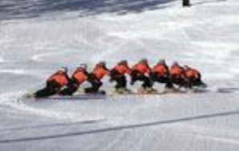

# Carving Practice Drills

Compiled By Jack Michaud

This was a popular thread in the forum. Below are some practice drills to help
you hone your carving skills. Note that these are not methods of normal every-day
riding, but special challenges to isolate particular aspects of carving.

### [The Norm](/alpine-carving/articles/norm-part-1/article.html)

**Grade**: Green

If you've new to this whole carving thing, start here. The norm is a
skill to help you feel the edge and sidecut working to execute a clean carve for

### [The Norm Part II](/alpine-carving/articles/norm-part-2/article.html)

**Grade**: Green, Blue

Try this next.

### Heelside carves

**Grade**: Blue

Rear hand grabbing front boot cuff: With your
rear hand (right hand for regulars, left hand for goofies), see
if you can make a heelside carve such that your rear hand can
easily grab your front boot cuff. Don't simply bend over or sit
down and reach for the cuff - assume a poised carving position
and get low by making a deep carve. Bend your knees only enough
to provide suspension, and angulate sideways at the waist to
maintain a more upright upper body. Grab your boot cuff and hold it for the
duration of the carve. This "freezes" you in this position and allows you to feel
it working throughout the carve.

**Variations:** rear elbow touching front knee; rear
hand grabbing board edge near front foot (see above picture).
Below is a picture of a very nice heelside carve. As you can see, the rear hand
could easily be placed on the front boot cuff from this position.

### Toeside carves

**Grade**: Blue

Like the grabs described above, but for toeside. Front hand
grabbing rear boot cuff: make a toeside carve such that your front hand can grab
your rear boot cuff with your arm going behind your butt (not
between your legs!). Again, do not simply crouch down or bow your
chest towards your toeside edge. Make a clean, angulated turn
with a mostly upright upper body, looking where you are going,
and knees bent for suspension. Practicing this will lead to wellbalanced toesides like this one:

### Bamboo

**Grade**: Blue

"Borrow" a bamboo pole and ride with it. Hold it with your fingers only
- don't wrap your thumb around it, you can sprain your thumb if you fall while
holding the pole like that. The object of this drill is to keep the bamboo pole
perpendicular to your board, and level to the snow at all times while carving.
This is trickier than it sounds; it's good to have someone watch and tell you if
you were actually doing it. This helps you to keep level shoulders, and to break
the common habit of "opening up" on heelside and facing downhill - you want to
maintain consistent alignment with your board.

The above drills will help you learn to face more towards the nose of the board.
It is common for new carvers to start with a more sideways body position where
they tend to face their toeside edge. This can lead to many bad things,
ultimately a loss of balance. Facing sideways usually results in bending over and
reaching down for the snow on toeside, and "sitting on the toilet" on heelside -
excessively bending the knees and hanging your butt off to the side of the board.
You want to keep your butt over the edge, and bend your knees to absorb terrain,
not just to get low. As you get better at carving, you may find that you will be
more comfortable aligning yourself with your binding angles, rather than the nose
of your board. Either works fine, but trying to face the nose can really help
break bad habits.

### Look ma, no hands

**Grade**: Green

Ride with your hands on your hips, or with your arms
crossed, or hands in your pockets - basically anything to take your hands out of
the equation. Sometimes we rely too much on our hands for balance, and sometimes
we wave them around for no reason. So get rid of them. Realize that a quiet upper
body is the key.

### Pencil Pinching

**Grade**: Green, Blue

This is something to imagine happening when you angulate at
the waist to keep your shoulders level to the hill. When you make either a
toeside or heelside carve, pretend that you are trying to hold a pencil in the
crease that forms at your waist. No, not under your gut, on either side, just
above your hips.

### Triple turns

**Grade**: Black Diamond

Between each carve, instead of making just one edge change, make
three quick cross-under* edge changes in a row as you traverse the trail. (i.e.:
make a regular gs carve on left edge, then in the transition quickly go right
edge, left edge, right edge) If you have room, go for five. This teaches you feel
for your edges, and teaches you that upper body gesticulations are unnecessary
for changing edges. Lowell Hart adds: This requires a rider to apply knee and
ankle angulation to engage and release the downhill edge, and to make larger hip
angulation/inclination moves when cutting a hard turn at the trail's edge.

**Cross-under** turns are described in [this article](/alpine-carving/articles/cross-over-under-through/article.html). The picture ~~to
the left~~ below shows a nice sequence of a cross-through turn, which
blends cross-over and cross-under techniques. The rider is low
in the carve, then rises up only enough to bring the knees up
and flick the board onto the new edge. The board crosses under
the hips while the hips cross over the board - hence "crossthrough". Smooth.

### Boots

**Grade**: Blue

Try riding with your boots in walk mode. Try with your boots in walk
mode and unbuckled. This teaches foot and leg balance. You may be relying too
much on your hard boot shells for balance... are you? Also riding in walk mode
can help you get forward and attack the nose at the beginning of each carve.
Sometimes the stiffness of hardboots can be hard to overcome when attempting the
forward weight shift.

### Fakie Eurocarve

**Grade**: Double Black Diamond

Do this by making a toeside carve, and in the transition spin
180 and make another toeside carve going backwards. (use caution! only on well
groomed uncrowded slopes!) This is another balance skill. If you are in good
balance, a fakie eurocarve will happen with surprising ease!

### Heads up

**Grade**: Green

just before the finish of one carve, before changing edges, turn your
head and pick a spot on the other side of the trail to aim for (a tree, pole,
pile of snow, etc). Make the edge change and the next carve all while looking at
this spot. Our body is built to follow our eyes. We can't carve very well across
the hill when we are looking downhill.

### The G Spot

**Grade**: Green

jtslalom writes: I became a true carver when I asked a 17 year old
FIS ski racer what he thinks about when he is about to come into a GS gate. He
pointed to 6 inches in front of his binding and said," I concentrate all my
energy right there." Since then I've learned to model my riding and training
after GS skiers and it has worked for me.

### Up the Ladder

**Grade**: Blue

Lowell Hart writes:

Isolate each one of the possible movements to tilt the board on
edge, starting with quick movements of the ankles. After a bunch of repetitions,
move up to the knees, trying again to isolate the movement and not using any
other movement to tilt the board. From there move to the hips, then incline the
whole body to tilt the board. This works especially well as a warm up exercise,
as each of these movements will be used when carving. Performing each one of the
movements will warm up the surrounding muscles, oxygenate blood, and lube joints
along the entire kinematic chain, rather than only in one area of the body.

### Singletrack

**Grade**: Blue

Ride exactly in the track of a rider ahead
of you, or your own track (on subsequent runs) if you are a
loner. Requires subtle movements of knees and ankles to
fine tune edge angle, quick fore/aft adjustments to further adjust the shape of a
carved arc, and develops perceptual skills as a rider is forced to look ahead to
see--and follow--the track.

### Runaway Train

**Grade**: Blue, Black Diamond

Ride a track one foot to the right (or left) of the track
preceding you. If you are lucky enough to ride with a posse, have the entire
group try it with each subsequent rider riding one foot to the left (or right) of
the preceding track. This increases the challenge as later riders have to make
big turns toeside and tight arcs heelside and vice-versa. Develops similar skills
as Singletrack, but with the additional 'big turn, small turn' challenge.

### Shadow Slalom

**Grade**: Green

On a sunny day, ride a slalom course around chair shadows under
the chairlift. Develops further application of edging and fore/aft movement
options, and perceptual skills (looking ahead and choosing line).

### Pierce the Pile

**Grade**: Green

Pick out shadows, small piles of snow, or other objects and
'pierce' them with your carving edge. Works on controlling your line, not the
board controlling you.

### Air Change

**Grade**: Black Diamond

Carve off small bumps and rollers and change edges in midair. Land
softly, carving on your new edge, maintaining the integrity of the carved arc
throughout. Further develops pressure management, edging, and fore/aft movements,
plus balance and perceptual skills.

### Suck ups

**Grade**: Blue, Black Diamond

Carve off small bumps and rollers and change edges in midair. Land
softly, carving on your new edge, maintaining the integrity of the carved arc
throughout. Further develops pressure management, edging, and fore/aft movements,
plus balance and perceptual skills.

### Combos

**Grade**: Blue, Black Diamond

Mix up carved extension and retraction (cross-over, cross-under) turns
so you can perform either on command. Develops the ability to extend or retract
the legs to better manage forces through the finish of a carved turn.

### Turbulence

**Grade**: Black Diamond

Make long radius carved turns through small bumps and 'harbor
chop'. Progress to larger bumps when your legs feel youthful. Develops pressure
management skills and 'de-couples' flexing and extending movements from edging
movements.

### Cat and Mouse

**Grade**: Blue, Black Diamond

Boostertwo writes:

Ride with a partner. One is the mouse, the other the cat. The
mouse tries to shake the cat while carving turns. The cat rides a safe distance
behind and tries to match the mouse turn for turn. After a while, switch roles.
Good to develop the ability to instantly make turns of different shapes and
sizes, and for looking ahead.

### Human Giant Slalom

**Grade**: Blue

Boostertwo writes:

Ride with a group, the bigger, the better. The object is
for the entire group to ride through a GS course made up from the other group
members. Start by having each member of the group position himself (stopped) on
the trail so that the entire group makes up a GS course. Alternating 'gates' hold
one arm to the right/left to indicate the direction on which to pass. When
everyone is ready, the rider at the top of the course goes first, with the
following riders starting as soon as the 'gate' above them rides by. Thus,
several riders are on course at any given moment. Safe passing is allowed and
encouraged, but no hitting gates or others on the course. As soon as a rider
'finishes' the course, they set the next gate, which they do by stopping and
holding out the appropriate arm to indicate turn direction (dictated, of course,
by the rhythm of the turns immediately above him.) Leapfrog in this way all the
way down the hill. Develops the ability to make carved turns of different shapes
and sizes, and choosing line.

### Retraction Boosters

**Grade**: Blue, Black Diamond

At the very end of a carved turn, use a quick movement of
the ankle/knee to tilt the board even higher, rather than reducing the edge angle
to start the new turn. This sudden increase in tilt tightens the turn radius and
creates an even faster retraction (cross-under) turn. *Jack notes: this is like
the practice of "counter-steering" on a motorcycle - turn the bars left to flick
the bike under you and to the left, resulting in leaning the bike to the right
for a right turn.*

### Skid/Carves

**Grade**: Blue, Black Diamond

Alternate between skidding and carving on a single traverse and on
single turns. Extend the rear leg to break the tail out of a carved arc, then
retract it to realign the board so it points exactly in its direction of travel.
Develops sensitivity to both skidding and carving, and the ability to regain the
arc if the board starts to skid.

### Lock-ons

**Grade**: Blue, Black Diamond

Unweight and make a change to the board's steering angle (pivoting it
through the initiation of the turn) while it's light. Come down and immediately
"lock-on" to a carve on the new edge, carving the middle to the finish of the
turn. Start with small steering angle adjustments and make larger steering
movements as you develop proficiency. Develops the ability to make a big steering
angle adjustment when the course demands it or to regain a better line while on
course.
photos courtesy of Jack Michaud, Boostertwo, Chris Karol

[norm-part-1]: /articles/norm-part-1/article.html
[norm-part-2]: /articles/norm-part-2/article.html
