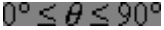
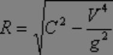
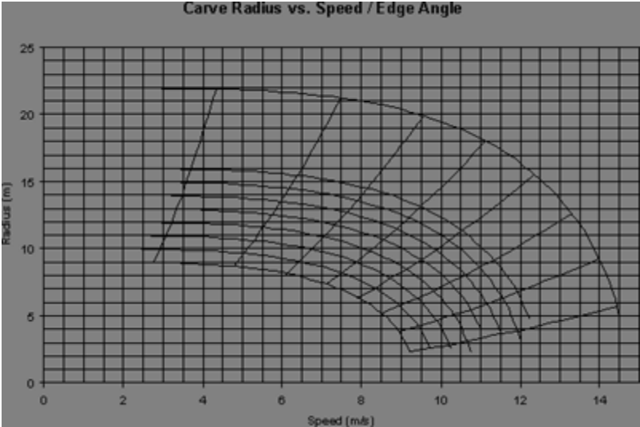
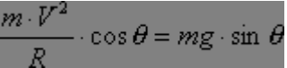

# Physics of a Snowboard Carved Turn

By Jack Michaud and Iain Duncumb

The snowboard is a wonderful tool that serves many purposes. We use
them to have fun, to blow off steam, to exercise, to enjoy the
outdoors, and to share good times with friends. However, as we use
them, our subconscious learns valuable lessons in Physics. With a
little trigonometry, we can realize a few key things that happen as we
carve, that we can then consciously contemplate on the hill.
Appreciating and understanding the physics at hand, we can become
better carvers.

Have you ever taken a snowboarding lesson where the instructor says
"keep your body over the board… this puts more weight on the edge"?
While keeping your body over your board is good advice, the benefit is
not that you somehow generate more weight on the edge. If while
considering your instructor's sermon you thought to yourself "I can't
put any more or less weight on the edge, I only weigh so much!" for
the most part, you'd be right.

The real benefits to assuming a poised racer-type body position are
balance and angulation. As we tilt our snowboard up on an angle, the
shape of our snowboard carves a circular path in the snow. As we
travel around this path, we feel a centrifugal force that seems to
pull us towards the outside of the carve. To balance this force, we
lean in towards the center of the carve. This is just like trying to
walk while carrying a heavy suitcase in one hand. We have to lean away
from the suitcase in order to balance. While we carve a turn, our
centrifugal force is the suitcase. (Physics purists will insist that
there is no such thing as centrifugal force and that it is only proper
to speak of centripetal force acting towards the center of the circle.
Though this is true in an absolute frame of reference, it is perfectly
acceptable to discuss centrifugal force in a body-centered inertial
frame of reference.)

You feel this every time you snowboard, you knew that already. But
consider this chain of logic. Centrifugal force is determined by our
speed and the radius of the turn. Our centrifugal force determines how
much we need to lean in. Our lean angle helps determine our edge
angle. Our edge angle and the sidecut of our board determine the
radius of the turn. Sounds like a circular argument, right?

Consider this diagram:

- cog = center of gravity
- E = point of edge contact
- m = body mass
- θ = edge angle
- V = velocity (speed)
- R = turn radius

Omitting the effect of angulation for the moment, we tilt the board up
and lean by angle θ in order to balance the centrifugal force mV2/R.
The equation for this balance looks like this:

We shall ignore the effect of hill slope angle for the purposes of
this discussion, as the analysis becomes much more complicated. For
the complete description of the equation for a carved turn accounting
for hill slope angle and rider position along the arc, make a
pilgrimage to the library and pray that they have a copy of John
Howe's book Skiing Mechanics. This representation of the balance of
forces applies to any object travelling in a circular sense, so we can
use it as a close approximation and a good illustration.

Before we continue, let's define a few terms. Inclination is the PSIA
term for the lean angle of our center of gravity. Angulation is the
PSIA term for creating angles in the body. If you stand on your board
like a pole and simply lean into a turn, you are turning with no
angulation, only inclination. When we bring angulation into the
picture, some interesting things happen. By creating angles with our
ankles, knees, waist and shoulders, it is possible to increase actual
edge angle with respect to our angle of inclination. But the end
result may surprise you.

To solve the equation for all of the above variables, we shall assume
that our rider is making a purely inclinated turn, whereby the board
remains perpendicular to the line between E and COG. In this case,
edge angle and angle of inclination are one and the same. We can then
approximate the turn radius our sidecut will carve when we lean in to
the turn as:

where C is the sidecut radius of the board, and

By substituting this equation for R into the above equation, we can
write:

which reduces to:

Remembering that sin2 + cos2 = 1, we can write

or

Using this in our equation for R, we find:

Multiply the C through, and the final equation relating turn radius to
speed and sidecut radius becomes:

It is clear that a given speed results in only one real carve radius
where the sidecut is dictating the path, without angulation. We can
calculate values of R versus V for given sidecut radii in a
spreadsheet and plot the results:

~~Click Here~~ for a clearer version

The downward curving lines represent our carve radius decreasing as
speed increases. For reference, 10m/s = 22.5mph. Each curve is plotted
for a different sidecut radius. The bottom curve results from a 9m
sidecut radius, similar to many freestyle boards about 160cm long.

The downward curving lines represent our carve radius decreasing as
speed increases. For reference, 10m/s = 22.5mph. Each curve is plotted
for a different sidecut radius. The bottom curve results from a 9m
sidecut radius, similar to many freestyle boards about 160cm long.

The top curve represents a 22m sidecut radius, similar to many of
today's semi-shaped skis. The curves are incremented by 1 meter, with
a gap between 16m and 22m. The straight lines that cross the radius
curves represent lines of constant natural edge angle; "natural edge
angle" meaning the angle that must be used without angulation. A dead
weight could carve a snowboard balanced at the natural edge angle for
a given speed, on a smooth surface. The left-most line displays a
natural edge angle of 5° and the right-most line represents a 75°
natural edge angle. These lines are incremented by 10°.

Example: using a board with a 12-meter sidecut radius at a speed of
about 9.8m/s, we can carve a 7-meter radius turn using a 55° natural
edge angle. If we tried to lean over any further, we would simply fall
to the inside of the turn. If we didn't lean in enough, we would slide
the board along a broader turn.

Admittedly, the decreasing radius with increasing speed seems counterintuitive at first glance. Obviously, we can go careening down the
hill at break-neck speeds making very broad, barely leaned-over turns.
But in this sense, we are not truly carving the sidecut; we are
forcing it to take a path other than the one its shape would rather
make. Think about when you are carving down a gentle slope at
relatively low speed. You can only lean over so much. Tearing down a
steeper slope at high speed, we can lean over all we want. The more we
can lean, the tighter radius we can carve.

Also, we can pump our turns with our knees and make sharper carves
than these equations would permit. But a pumped carve is short-lived,
as the pumping effect only lasts for a moment. Pumping temporarily
magnifies force on the edge. Pumping a carve is almost always followed
by a change of edges, as in slalom carving or slalom racing. If we
apply additional force with a pumping motion, we can alter carve
radius – briefly. But it's a trade-off. Pumping can benefit you in
situations where you need to make a quick turn, but it can hurt in
others where margin for error is slim, as the exaggerated up and down
motion could upset your balance.

Back to the instructor telling you that one body position somehow puts
more force on the edge than another. This is simply untrue. A person
weighing a certain amount travelling at a certain speed around a
certain radius only generates one certain amount of force on the edge.
The force on the edge is the combination of our centrifugal force and
our weight, if we are carving a consistent, sustained, non-pumped
carve.

Perhaps the instructor tells you that assuming the racer-like position
puts more body mass close to the edge. Now this is true. But it is
important to realize that this does not generate more force on the
edge, rather, it enhances balance. Notice that the distance between E
and COG plays no part in the above equations. Therefore it is possible
to carve a turn using either a low, properly angulated body position
or an extended, laid-out, purely inclinated body position. This is why
"eurocarves" are possible. However at high speeds on steeps and ice,
eurocarving would require impossibly super-human balance

Having our center of gravity close to our point of support improves
balance in all situations. It is easier to walk on a short pair of
stilts than the two-story rigs you see at the circus. It is easier to
ride your bicycle no-handed sitting in your seat than standing up on
the pedals. The racer-like position, with deeply bent knees, upright
upper body and shoulders level to the hill minimizes the distance
between E and COG and therefore improves our ability to maintain
balance while carving high speed turns on the steeps.

But what is the use of this information? It comes in very handy when
selecting a snowboard for a particular use. Say you were looking to
purchase a new carving board and you narrowed your selections down to
either Prior or Burton. Prior's WCR175 has a sidecut radius of 11.5m;
Burton's Factory Prime 173 has a sidecut radius of 13.31m. What this
tells you is that the Prior will reach a particular turn radius at a
slower speed and lower edge angle than the Burton. Also, at a given
speed, the Prior will be carving a tighter turn. This may be a good or
a bad thing depending on what you want to do. If you spend most of
your time riding the narrower trails of eastern North America, the
Prior would be the better choice. If you ride wide open terrain where
you can arc huge high speed turns at your leisure, the Burton might be
a better choice.

If you're a racer and you prefer the round-carves/stay-high technique,
the Burton would carve a given radius at higher speed. If you race
using the point-straight-at-the-gate-and-make-a-quick-turn-at-thelast-second technique, the Prior would make a quicker carve at a given
speed.

Or, let's say you've been riding something like Burton's FP164 and
you're considering something longer. If you like the size and shape of
the carves you make on the FP164, but you feel you need more edge
hold, you would want to shop for something with more length but
similar sidecut radius. Noting that the FP164 has a sidecut radius of
11.79m, you would be wise to select the WCR175. It will carve turns of
similar radius, but alas, there's no such thing as a free lunch.
You'll have to exchange the lighter weight and maneuverability of the
164 for the superior edge hold and stability of the 175.

But what about angulation? Remember, angulation serves to adjust
actual edge angle with respect to inclination angle, to a limit. With
a purely inclinated turn, our edge angle and inclination angle are the
same. Using angulation, our edge angle and inclination angle can be
different.

Let's suppose we have a snowboarder using a board with a 12m sidecut
radius. From the equations, we can determine that when this
snowboarder makes a purely inclinated carve at 9m/s, he will be able
to carve a turn with an 8.7m radius. This will occur at an angle of
inclination of 43.5°. If he tries to lean in any further without
angulating, he will simply fall to the inside of the turn. But what if
he does use angulation? We must write new equations to determine what
happens. The balance of weight vs. centrifugal force is:

which reduces to:

But with angulation, we have a new expression for R:

We show the extra angle δ supplied by angulation as being added to the
angle of inclination. The sum of θ + δ is the total edge angle of the
board.

When our snowboarder was only using inclination, traveling at 9m/s,
his maximum edge angle was 43.5°. Using angulation, we can get around
this apparent limit. Let's now suppose that the snowboarder uses
angulation to dictate a 50° edge angle. The balance of forces becomes:

Therefore, the angle of inclination must be = 46.9°

Since edge angle is q + d, the snowboarder is using 3.1° of
angulation. This allows a carve radius of 7.7m, at the speed of 9m/s,
where before he was only able to muster an 8.7m radius without
angulation.

It is interesting to note that angulation allows us to increase
inclination as well. Think of it this way. Increasing edge angle
reduces turn radius. Reducing turn radius increases centrifugal force,
at a given speed. The increase in centrifugal force requires our angle
of inclination to increase.

Another curious effect of angulation is that as speed increases, the
difference between the edge angle and the inclination angle gets
smaller and smaller. At a speed of 10m/s, a 12m sidecut radius would
produce a 6.3m radius turn, without using any angulation. The
inclination angle and the edge angle would both have to be 58.3°, and
no greater. Using angulation to increase edge angle to 65°, we find
that the new angle of inclination is 63.5°. The angle supplied by
angulation must be 1.5°. Evidence of this is shown in this picture of
a racer, displaying excellent technique:

He is obviously angulated, but as he is moving at high speed, his
inclination angle and edge angle are very close. If we were to draw a
line from his center of gravity to the top of his board, it would be
almost perpendicular to the top of his board. Without angulation, the
line from his center of gravity would be exactly perpendicular to the
top of his board. Had he not used any angulation, he wouldn't have
been able to lean in as much. By using angulation, he carves a tighter
turn, and is in better position for the next gate. He also gains
stability by keeping his center of gravity closer to his point of
support.

Why bother with all the physics and trig? You certainly aren't
required to get so theoretical about it because our bodies can feel
when we're balancing the forces properly. To have an understanding of
some of the physics of carving could provoke you to consider aspects
of your riding that you might not have otherwise. You might even
consider it fun to ponder all this while carving, and to know exactly
what is going on. These toys we strap to our feet provoke our brains
to work probably twice as hard as normal, computing thousands of these
physics calculations every second we spend hurtling down a snowcovered slope. Yet this is the stuff that recharges our batteries,
fuels our spirit, makes us feel alive. Physics is what is at the heart
of it all, and to know it is to know the heart of snowboarding.

Reference:
Skiing Mechanics, John Howe
Poudre Press
1983
