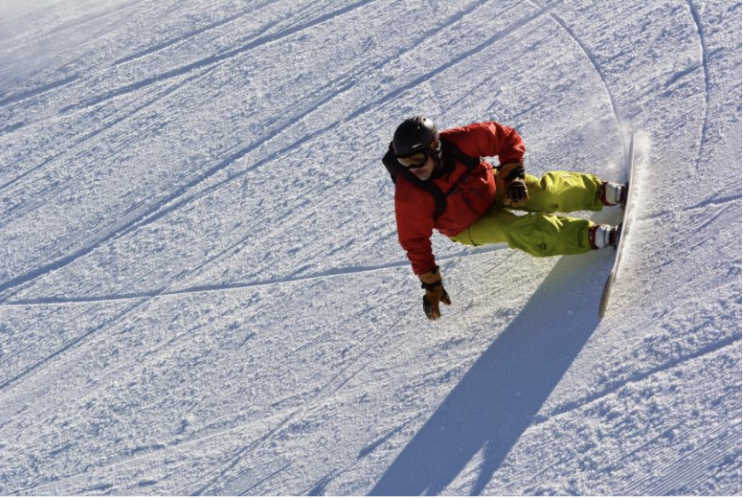

# Carving the Steeps

By Doug Taylor

Photo courtesy of Chris Chabot

Once a rider gets the hang of it, it's not too difficult to carve pencil line trenches
on moderate terrain. But have you ever ventured onto to steeper slopes and have
everything fall apart, so that your tracks look more like they were painted with a
broad brush? It's a common problem.

Three things are required for successful carving on steep terrain: good technique,
muscular strength, and nerve.

Perfect technique isn't required to hold an edge on the easier slopes, since the pull
of gravity and the forces driving the rider's mass to the outside of the turn are
relatively slight. Not so in steep terrain, where such forces can be great. In order
to stick a carve in the steeps, the rider must simultaneously create a high edge angle
and maintain edge pressure without releasing it. Otherwise, the board will skid or pop
out of the pencil line and the carve will be blown.

There are two common technical mistakes that impede holding a carve. On toeside turns,
it is bending at the waist and leaning the upper body into the hill, while keeping the
legs stiff and straight. On heelside, it is keeping the shoulders and hips parallel to
the board, likewise with straight legs and the butt sticking out over the inside edge.
Bending at the waist and leaning into the turn on toeside will decrease the board's
edge angle, and the stiff legs associated with this position prevent the rider from
absorbing the pressure that builds as a turn progresses. The loss of edge and release
of pressure will inevitably lead to a skid. Similarly, aligning the shoulders and hips
with the board edge on heelside also releases pressure, even if a decent edge angle
can be maintained.

In contrast, keeping shoulders and hips square to the board on toeside, and aligned
with the rider's stance angles on heelside, with knees and ankles flexing deeply as
the turn progresses, help to create a high edge angle and maintain pressure at the
same time. This way, the board can be guided through the turn with surgical precision.
Equally important is keeping shoulders level with the slope, so that the uphill arm is
held high, away from the snow on the inside of the turn, and downhill arm is held low,
toward the snow, on the outside of the turn. This position is almost exactly opposite
of what many beginning and some intermediate carvers adopt: they want to reach down to
the snow with the uphill hand. All that accomplishes is a reduced edge angle and a
release of pressure as described above. Keeping the shoulders parallel to the slope of
the hill, on the other hand, creates an angle between the hips and trunk (you should
feel a pinch at this joint) so that the rider's weight can be concentrated over the
inside edge of the board. The steeper the terrain and the harder the snow, the more
important it is to keep the center mass over the inside edge. This helps the board to
grip the snow and hold, rather than release and skid.

Practice good technique on moderate terrain and get it imprinted in your muscle
memory. Once you master it, the two other factors come into play. An edged board on
steep terrain will accelerate tremendously, and you have to develop both the leg
strength and the intestinal fortitude to handle it. Weak legs won't withstand the
forces generated by the turn. There's no substitute for keeping in shape year round in
order to keep your quads hard and beefy; cycling on and off road and weight lifting
are my favorite forms of cross-training.

And a faint heart will balk at the speed, causing the rider to stand up and bail out
rather than charge onward and downward. But as you continue to practice and gain
experience, you will develop the confidence to hold on. In time, you will descend the
steepest pitches with power, style and grace.
