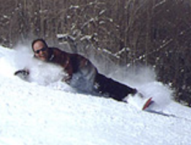
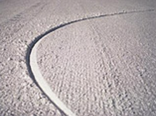

# Craving the Carve

Jack Michaud

December 1996

(note that this was written before shaped skis became popular)

What is it about riding Alpine snowboard equipment? What makes some snowboarders revert back to those stiff, clunky boots from whence they evolved, and ride boards that are too stiff or too long to bust "phat" air in the pipe or spin in the park?

Well, there is really only one answer: it's fun. Riding Alpine is one of the most exhilarating snowboard experiences. Those who switch don't even miss the jumps or jibs they might have hit on a freestyle board because they're too busy driving their own private Formula-1 car down the mountain. Nor do they regret the time spent adjusting to hardboots. Making a clean carved run down your favorite slope is just as gratifying as landing a 540 corkscrew.

Only hardboots and an alpine snowboard can reveal a secret about a snowboarding:there is a lot of power locked up in an alpine snowboard that's just waiting to be unleashed. A friend of mine compares alpine snowboarding to Aikido, the martial art which redirects an attacker's energy in a way that makes it work for the defender. The idea is that the snowboard is a tool used to harness the forces of nature in a positive way. The alpine snowboard combined with hardboots is the most efficient device to take gravity and channel it through yourbody, boots, board, and down into the snow. The result: perfect half-circle, two-inch wide tracks on the corduroy, the sensation of laying out your own roller-coaster and hanging on.

Alpine riders use gravity much like a sailor or windsurfer uses the wind to cut the fastest tack across the water. By redirecting the force of gravity, the snowboard takes the rider in a direction different from that which gravity would normally dictate. This difference is what enables snowboarders to control how fast and wide they carve down a hill. Toying with gravity by making delicate adjustments from foot to foot and from side to side to get the fastest and cleanest line down the slope is the never ending pursuit that alpine riders crave.

Gravity is also used in another way, much like a motorcycle rider out for a joyride on a freshly paved, winding road. An alpine snowboarder gets that momentary feeling of weightlessness that comes between carves, just like the motorcyclist negotiating an S-turn. This is something skiers rarely feel. Two things separate the alpine snowboard from skis as the superior tool for achieving this sensation. One, is that both feet are mounted on one board. Once you're committed to a carve, there's no other leg underneath you to serve as a safety net. Once you cross the board, gravity and self trust takeover. More dramatically though, the shape of the snowboard is the real advantage. Since snowboards are so much wider than skis, designers have free reign to dictate how much sidecut goes into your board, and can more directly fine tune how your snowboard will behave.

All that wonderful sidecut enables riders to carve turns as tightly as he or she can bend the board. Alpine riders get dramatic sensations of free-fall by using this characteristic to their advantage. You may notice that the tracks of an carving snowboarder actually start well before the snowboard has entered the fall line. The rider can actually move his or her body across the board in a downhill sense while carving the downhill edge until the board carves around and back beneath them at the end of their free-fall. By timing the turn transition with a roll in the hill, the free-fall can be even longer. If you watch an alpine snowboarder carving turns below you on a hill, the bottom of the snowboard is visible at the beginning of each carve.

If this sounds tempting, don't be afraid to try. The sensations described above are only a few of the many that a good alpine snowboard and hardboots can afford you. Give it a try, you'll probably love it. Oh, and if you're worried about getting hooked, you won't even notice. I didn't.
