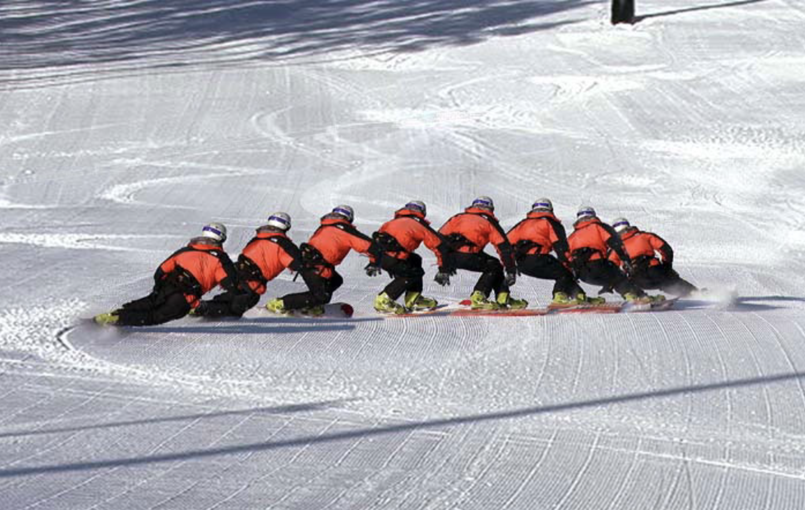
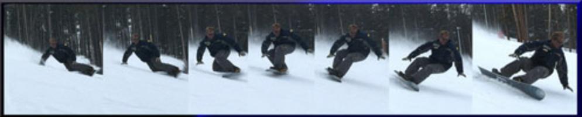

# Cross-over, Cross-under, Cross through

By Jack Michaud, 3/02

Perhaps you've heard these terms before, but never had a clear definition of their meaning and application to the carved turn. Each is an important skill to have in your bag of tricks, as they will make you a more dynamic, versatile, and confident carver. If you have reached a point in your carving where you have mastered the easy trails, but feel you are building up too much speed to handle on the steeps, this will help. Or if you've already tamed the steeps, practicing these techniques will help your smoothness and balance.

Cross-over, cross-under and cross-through are descriptions of different ways to execute a carve transition, referring to how the body and board change position relative to each other. Basically, when we change edges we need to take our weight off one edge and get it to the other edge using one of these three methods. Cross-over and cross-under are defined by the PSIA, and to the best of my knowledge, cross-through was coined by Erik Beckman at the Sugarloaf/USA ski and snowboard school, sometime just before the shaped ski revolution. He found it necessary to categorize this technique that ski racers had been using for years, but that alpine snowboarders were beginning to exploit with their sidecut advantage.

Cross-over is the technique of moving the body up and over the board by extending the knees. If gently executed, this amounts to simply standing up at the end of one carve, and sinking back down into the next. At the top of your extension, your upward momentum takes pressure off the carving edge, and you are free to move your body across the board, and back down into the next carve, returning pressure to the other edge. In this case, you are compressed at the apex of each carve, and extended in the transitions.

When exaggerating cross-over turns, you can maximize that weightless feeling between carves. You can combine this technique with a spring off the tail, and actually catch air between carves. This can be quite exhilarating, especially if timed with a roll or spine in the hill, resulting in some serious distance and hang time. Landing such a jump on edge, already in the next carve is not only fun and impressive, but a good way to hone your balance as well.

Cross-over is probably the first type of turn transition you ever learned, and the most intuitive way to change edges. It is what you did if you ever practiced the ["Norm"](/alpine-carving/articles/norm-part-1/article.html) method of learning to carve. However it is the slowest method, and it results in the most displacement of your center of gravity. This puts your precious balance at risk on ice, at high speed, on steeps, or all three. Also you may find yourself on a narrow swath of groomed snow such as a skinny trail or a half groomed half mogul trail, and you simply won't have enough real estate to use the cross-over method. If you aren't accomplished at other methods, you'll have to resort to skidding turns when you could otherwise be carving.

Cross-under is the technique of quickly sucking the knees up towards the body to relieve pressure from the carving edge. Strictly speaking, cross-under is the practice of letting the board move back and forth underneath you. For example, when you are making quick fall-line slalom type carves, your upper body stays mostly facing downhill, while your lower body swings back and forth from side to side. Your center of gravity doesn't move much in either the up and down or side to side directions. You are extended at the apex of each carve and compressed in the transitions.

You can practice this method on an easy slope by imagining that your head is traveling down the hill inside of a pipe, or that you are balancing a loaded lunch tray on your head and you make the carves happen as smoothly as possible from the waist down. Be careful not to allow your arms to swing from side to side across the board, and not to swivel excessively at the waist. This is wasted motion that compromises your balance. A quiet forward facing upper body is key. Cross-under is also important when attacking the moguls, where you want to keep your center of gravity steady and balanced, while your legs and knees do all the work.

Cross-through is important to consider, because it is real, useful, and different from the other two. Cross-through is a blend of cross-over and cross-under. The more cross-under you blend in, the faster the transition can happen. Part of the difference between cross-under and cross-through, is that cross-through is usually used in GS style carves, where the upper body stays aligned with the board, not the fall-line, and where our body travels in a rounder path, rather than straight down the hill.

In these high speed and/or high-g carves, we are usually compressed and low for maximum balance in the middle of each carve. Or if snow conditions permit, we may be fully laid out in a big eurocarve. At the transition, we have nowhere to go but up. But rather than standing all the way up, we want to only rise just enough to allow us to complete the rest of the transition by pulling the knees upward. Hence the blend of over and under. We then simply and quickly roll the knees over the board, rather than lugging our entire body across the board. Our eyes lead into the next turn, and our upper body faces the direction of travel. Very little swiveling occurs at the waist.

This allows us to execute the transition in a minimum amount of time and space. The unique thing about the carve transition is that we have practically no control over the snowboard at that point because neither edge is fully weighted, and we are simply careening along in the direction of the end of our last carve. By minimizing this time and distance, we maximize control. Carving round turns controls speed, gliding between carves does not. Using cross-through allows us to start the next carve as soon as possible, regaining control over both our direction and speed.

Cross-through keeps our center of gravity as quiet and level as possible, which maximizes balance. You can think of your center of gravity also as your center of balance. Minimizing the amount of up/down and left/right movement of your c.o.g. between carves will increase your balance and your confidence. This also allows us to stay closer to the board, therefore more stable on our feet, significantly reducing the chances of simply falling over when trying to start the next carve.

Another benefit of cross-through is the alignment of our center of gravity with the turn's "roll axis". The roll axis is the imaginary line about which your body rotates in the left-right plane when you lean from one side to the other. When you use crossover in a GS carve, the roll axis is down at the level of your board, and your whole body moves back and forth over it. By using cross-through we can perfectly match the roll axis to our center of gravity, which results in optimum balance, stability, and smoothness.

A good carver has mastery over all these techniques. Practice them on an easy trail that will allow you to carve at a speed that is fast enough to make some well leaned over turns, but that is also within your comfort level. When you feel you are confidently, quickly, and smoothly transitioning your carves, head up to the steeps and feel how a swift, quiet carve transition allows you to link high speed carves with authority and turn heads on the chairlift!

*photos courtesy of Boostertwo*
