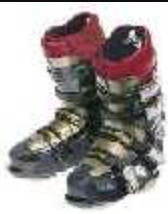
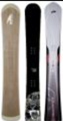

# Can You Start Snowboarding in Hardboots From Day One?

By Jack Michaud

**Yes.** Many people, sometimes even some resort professionals, will tell you this shouldn't or can't be done, but this only reveals that they don't know very much about riding in hardboots. Yes, there is something about hardboots that makes them look like they're harder to use, but the reality is that they're just different. In my personal experience, during my four years of instructing snowboarding professionally, I had several cross-over skiers start from scratch in hardboots. Not one of them had a more difficult time learning, and actually most of them had an easier time than their softbooter counterparts. They spent far less time on their butts in the snow, and appeared to spend less energy overall during the lesson. In fact, given the mediocre performance of the rental softboot gear, I was routinely amazed that anybody learned anything using it.

The support of hardboots help you maintain your balance far better than softboots. This is due to the fact that hardboots greatly reduce the amount of work required of the ankle. In fact, at low speeds they nearly eliminate it. In softboots, balance is a constant twitchy dance between your calf muscles and the muscles on the fronts of your shins - some of the weakest muscles on your body. Hardboots also support you laterally, significantly helping the muscles on the insides and outsides of your thighs with the balance work. The extra support of hardboots will make it easier to execute the beginner exercises in a lesson, especially the preliminary maneuvers you will be asked to perform with only the front foot strapped to the board. Once you're linking turns, hardboots will make it easier for you to begin carving sooner.

However, if you've never skied, you might find hardboots to be too much of a new and strange experience for your feet. In this case, you may want to start with softboots. But if you are attracted to the idea of hardboots, then go for it, your determination can make it work.

First, you need to find some alpine equipment to try. If an available resort or retailer rents boards boots and bindings, then you're all set, just rent the gear and take a lesson from a professional instructor. But chances are very good that your resort or retailer doesn't have the right size board or boots, or even better that they don't even know what an alpine snowboard and hardboots look like. In this case, you have two possibilities: borrow the equipment from a friend, or buy it yourself.

If you have ski boots already you can use them, but if they're super stiff racing boots, they may be a hinderence. Otherwise, retailers who sell, or used to sell alpine gear usually have leftover inventory they want to unload for cheap. Look for snowboarding specific hardboots and plate bindings. If snowboard hardboots can't be found, you can look for recreational ski boots. If you can't find anything locally, it's the Bomber Store to the rescue. If you want to be really economical, buy used. Don't be afraid to buy bindings that say "race" on the box, you want sturdy bindings.

> Missing image. Original URL: http://bomberonline.com/images/photos/photo_prior_4X4.gif

When it comes time to select an alpine snowboard, again you can look for leftover inventory or buy used, if you want to stick to a reasonable budget. Look for a board that comes up to around your chin or your nose to start out. For your first snowboard, an all-mountain carving board (see right) is the safest approach. The rounded shape of these do-everything boards will be the most forgiving to common newbie mistakes, and they will be the easiest with which to learn and progress. Also, they will be easier to ride all over the mountain in addition to carving the groomers well. A "freecarve" board may also be a good choice if you have experience with board sports, and are an accomplished skier, and you want to concentrate on carving groomers. A used race board can also be a good choice, as it will be "broken-in" for you. Just keep in mind that the racier the shape, the less easy it will be to skid the board when you need to.

When you have your board, boots and bindings, [Click here](/alpine-carving/articles/setup-plate-bindings/article.html) for help on mounting your bindings to your board.

Your first day on an alpine snowboard will probably feel awkward, as you will have both your feet rigidly bound to one plank. Just remember that this is a new animal, and try to relax. Things will be much easier if you don't try to muscle your equipment around, and try to go with the flow. Be patient. Definitely take a lesson from a professional instructor. The price of the lesson is peanuts compared to the agony of the sink-or-swim method, which can include broken wrists and concussions, in bad cases. Learning to snowboard is not as easy as it looks! A two-hour lesson will give you skills that would take several days to figure out on your own.

Of course, it is possible that a natural athlete, highly skilled at skiing and/or other board sports can jump on a board and be linking turns inside of an hour or two without a lesson. I've seen it happen. If you believe you are one of these superhumans, once you feel confident making turns on moderate greens and easy blues, you can start trying to carve by practicing the Norm technique.

Good luck!
