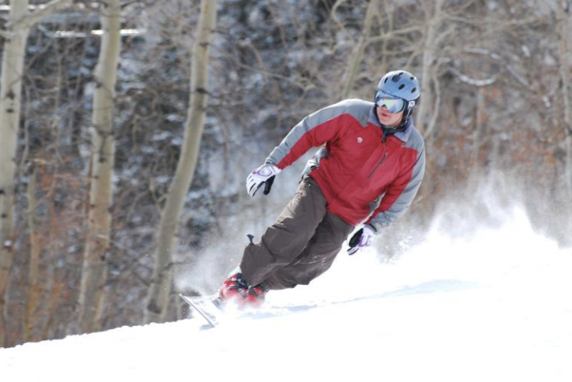
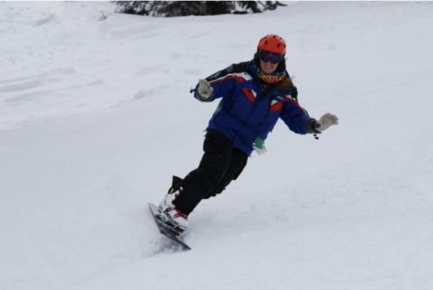
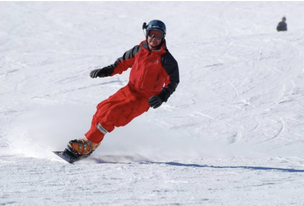

# Feel the Carve, Ride "The Norm": Part I

By Jack Michaud

photos courtesy of Chris Chabot

As it is in snowboarding, the hardest part about learning anything physical is starting without
already knowing what it feels like to do it right! So how are you supposed to figure out this
"carving" business if you don't know what it feels like when it happens? "The Norm" is a practice
tool to help you realize the sensation of carving the edge of a snowboard, so you'll be able to
work towards that same feeling every time you ride.

This skill is best practiced on a well-groomed, wide, unintimidating yet moderate green-circle
slope that will allow you to generate enough speed to make a well leaned-over turn. It is intended
for intermediate snowboarders on the brink of the carving revelation. It is not intended for
"never-ever" beginners. Basically, the idea is to get the edge to carve without actually doing
anything aside from simply putting the edge in the snow. This is achieved by standing straight and
tall on your snowboard and making a turn without bending a single joint in your entire body. The
turn is created solely by leaning to one side or the other while maintaining a rigid beam-like body
perpendicular to (i.e. 'normal' to) the plane of the snowboard.

Start down the trail and prepare for the norm by
assuming a stand-tall position with your arms
stuck down at your sides, your knees straight but
not locked, ankles rigid, and your body aligned
with the angle of your bindings. This position is
to be maintained at all times throughout and
between each turn while practicing the norm. The
object of this little game is to remove any
steering, skidding or sliding tendencies you may
usually have from your turn. Remember, a carved
turn happens when the nose and tail of the board
(and hence your front and back feet) travel along
the same path.

After you have built up enough speed by heading
straight down the slope for a short distance,
initiate a toe-side turn simply by leaning toward
that edge and pushing the edge down into the snow
with your toes. Have faith that the edge will
hold and not slide out. Let the turn take its own path all the way until it self-destructs by
eventually pointing back uphill. Maintain the norm position as long as possible, bending only at
the last moment to catch yourself from falling on your face. Once you stop moving, kneel down and
look back across the hill at your track. If the track is skinny and the path is round, behold! You
have just carved. If not, you probably allowed yourself the luxury of bent knees or a bent waist.
It is also important to turn your head and look towards where the carve is going to go while you
practice this, both for technique and for safety.

Now turn around, point the board downhill and repeat this process on your heelside edge. Continue
making toe and heel carves by carving all the way to a stop then rolling over, etc. Once you feel
comfortable doing this, it is time to start linking these norm-carves together.
The next most exhilarating skill the norm teaches you is that if your snowboard is carving across
the trail, you can actually change edges before you point the board back down hill, thereby carving
the downhill edge! This is because if the snowboard is moving strictly in one direction, you can
change edges and continue traveling in that direction. When a snowboard is sliding and not carving,
it can be reasoned that the snowboard is moving in a composite of two directions: across the hill
and down the hill. Never try to change edges while sliding; the downhill edge will catch if you try
to put any weight on it. When a snowboard is carving, it is moving only in the direction it is
pointing.

Changing edges before the board points downhill is
exactly what must happen when linking norm-carves
together. Instead of letting the carve turn up the
hill, lean out of the carve when you decide it is time
to change edges. Let your body come over the board and
proceed to lean towards the other edge. Your body
should remain rigid in the norm position, and cross the
board much like the mast of a sailboat at anchor,
rocking in the waves.

It may take a few runs practicing the norm before you
are able to execute clean norm-carves one after the
other without sliding. But once you are able to
confidently link carves like this, it is time to
incorporate carving into your all around riding. We
shall cover that in the next chapter, stay tuned.

Carving really only happens when we allow the board to do what it was designed to do. Whenever you
feel like your riding has turned into one big argument with your snowboard, take a breather on nice
green cruiser and practice the norm. Strip away all the unnecessary wasted motion and get back to
basics. After you feel the board carving for you, you'll know what to look - and feel for in your
everyday riding.
