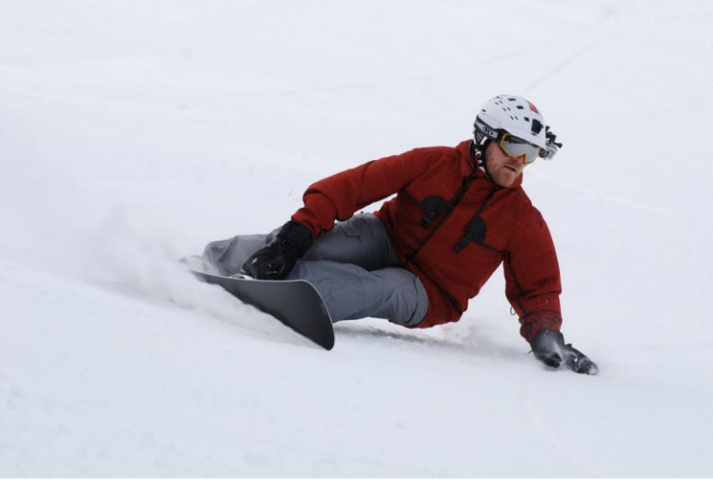

# Feel the Carve, Ride "The Norm": Part II

By Jack Michaud

photos courtesy of Chris Chabot

Ok, so now you're railing "norm" carves all over the green circles. Isn't it great to feel the edge
dig in and haul you around the turn? Now you need to transfer this carving effect in to your
everyday riding.

As we said before, the norm serves to remove all unnecessary motion from your turns and teach you
that a carve will happen if your weight is in the right place at the right time. Carving is that
simple. The complicated part comes when we try to carve at high speed, or on sub-ideal conditions,
or on the steeps, or all of the above at the same time. The reason you can't make norm-carves all
over the hill is that you are teetering on the edge of losing your balance when you simply stand on
your board like a pole. We must assume a poised position to be ready for the momentary disturbances
that try to knock us off keel.

After you've become comfortable executing linked norm carves facing sideways, take one more run
making norm carves facing forward. You want your shoulders to be square to the board,that is, your
chest should be facing the nose of the board, at all times throughout and between each carve. At
the same time, you want your hips to be just about square to the board as well. Make a run like
this and get comfortable facing forward. Take two runs like this if necessary. A very important
part here is to look where you're going… where you're actually going… as in, not just straight down
the hill! Our bodies are built to follow our eyes. If you're not looking into the turn, you stand a
poor chance of successfully making the right moves.

Now that you've got yourself facing forward, bring the knees and ankles back into the picture. Use
your knees to balance and absorb the terrain. This will allow you to go a bit faster than when you
were just making the straight norm carves. Take a run like this and pay attention to the fact that
you're changing edges before the board points downhill. We're still half-norm-carving at this
point; we're still mostly just leaning in and not bending anything from the waist up.

Next it's time to add in the upper body, head and hands. Think of walking on stilts. What's easier,
short stilts or the two-story rigs you see at the circus? The same applies on our snowboards. We
are able to maintain better balance when we keep our weight closer to the point of support, in this
case, the edge. Therefore, we can do this by keeping our upper body upright and our shoulders level
to the slope of the hill.

Here's where the hands come in. Our hands are our own built in balance poles, like the ones used by
tightrope walkers. We want our upper body facing forward and level to the hill, right? So that
means we want our hands level for good balance. Your arm on the inside of the turn should be raised
and the outside arm kept low to keep our shoulders level to the hill as we go around the turn.
Your head is the most important part of the picture. If your head isn't doing the right thing,
chances are your body isn't either. We all have an instinctive fear reaction called "target
fixation" where we see something we want to avoid so we stare at it. Then our bodies follow our
eyes and –smack- we hit it! Don't ask Darwin how we inherited that little feature. Ask any
accomplished tree-boarder or skier what the secret is and they'll tell you "look at the spaces, not
the trees".

Unless we teach ourselves otherwise, we will target-fixate on the fall line as we gain speed, which
causes us to not look where we're actually trying to go. Aside from leading to a potentially
dangerous situation, this is especially detrimental on heelside carves, as it causes our body to
turn towards the fall line as the board is turning across the hill. The remedy is to plot the
course of your carve in advance with your eyes. Also, don't look at the world sideways. Keeping a
level head works well to keep your shoulders level too.

So there… you've learned what it feels like to carve the edge using the silly but effective "norm"
method and now how to find this feeling with a real-world body position. "But I'm still just
leaning!" you say? Carving dynamics is next. Stay tuned.
