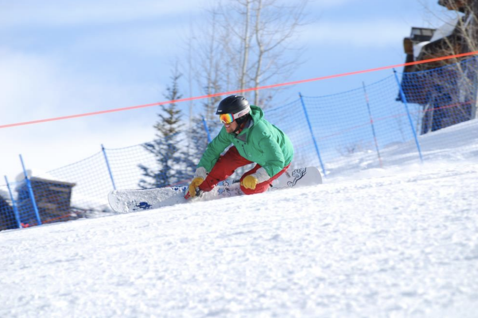
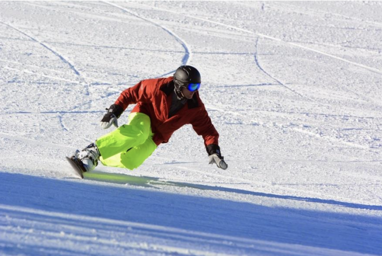

# Separate Zee Knees: A Whole New Carving Stance

By Jack Michaud, with contributions from Jim Callen

Photos courtesy of Chris Chabot

So just what are you supposed to do with your knees, anyway? Back when many of us were still
learning how to snowboard, there emerged possibly the first really identifiable style that pretty
much everyone thought looked cool. People like Craig Kelly and Keith "Duckboy" Wallace were riding
around with their knees jammed together, and yeah, it looked really cool! But now with the advent
of symmetrical race boards and steeper stances, the school of carving has changed, and riding
around with your knees stuck together is not necessarily the key to riding the sweet spot of your
board.

First, we need to define the modern carving stance to see how the knees fit in the picture. The
first step in achieving the modern carving stance is to square the shoulders and hips to somewhere
between the direction of board travel and your binding angles, and maintain this alignment at all
times throughout each carve. When this is working, the torso and hips are facing towards the nose
of the board. The hands are no longer leading and trailing, but are back to left and right, and
they stay that way. It is obvious that the surfers and skaters among us will have to adjust their
body and hand alignment, but the skiers have a less obvious task.

A cross-over skier will have to make the conscious effort to look in the direction of the carve,
rather than always down the hill. As carves progress around the curve, we are actually looking
across the trail at the beginning and end of each carve. This is also a much safer way to ride, in
addition to its benefit to carving. Maintaining proper alignment of the head with the board is
crucial to maintaining this stance, since the body is built to follow the head. If you make each
carve looking all the while down the mountain, the torso will open up, cease to be aligned with the
board, and the rest of the stance will fall to pieces.

The hands are equally important. Mechanically, the body wants to conserve rotational momentum. This
means, as the board and lower body rotate right, the upper body wants to rotate left, and the
would-be leading hand typically swings across the nose of the board when executing a heel side
turn. We want to avoid this tendency. By keeping the hands on their own sides of the board, and by
looking in the direction of the carve, we can prevent this counter-rotation from happening. The
result is greater stability, and consistent edge pressure. The board and body are unified as one
solid unit. With the counter-rotation, the upper and lower body separate, and the body position
over the edge changes, compromising edge pressure. By resisting the separation, we can maintain our
body position over the edge, and sustain better edge hold.

The second step in achieving this stance is to keep the shoulders level to the slope of the hill.
This helps keep more body mass closer to the edge, thus increasing edge hold. A good way to think
about doing this is to keep the hands both at an equal distance from the surface of the snow at all
times. This will help keep the shoulders level to the slope of the hill. When we tilt our shoulders
in to the turn, we are taking more body mass away from the edge, reducing edge grip. With a forward
facing posture and by keeping the shoulders level to the hill, we can keep more body mass closer to
the edge at all levels of angulation.

*Note how the rear knee is clearly visible
pressing to the inside of the turn, not
jammed behind the front knee. It is under
the rider's c.o.g., providing support. Also
note the hand position and shoulder
alignment. Rider: Trent*

Now, the knees. "What's so wrong about
riding with my knees together? It looks
good, and it feels good!" you might reason.
Sure, it does feel good, but it's only a
quick fix. By sticking the knees together,
they become a single point in the structure
of your body. Thus you are forcing your
center of gravity to find the center of your
board. Since the knees become one point,
your center of gravity finds its most
comfortable position directly over this
point. This point is also right in the
middle of your stance, which is where the board was designed to carve best. This is why carving
with the knees together feels good. Now, carving the sweet spot is what we are trying to achieve,
but with our knees stuck together, we are actually making it more difficult to maintain this
position when we encounter high speeds and/or variable terrain (i.e. ice, ruts, bumps etc.)

Here's why: with the knees together, there is a triangle formed with your board and your lower
legs. When you initiate a turn, in order to maintain that forward facing, level shoulders stance,
the angulation occurs mainly from the waist down. Therefore, it is the duty of the knees to get
underneath you, to the inside of the turn, in order to hold you up. As we attain higher speeds, we
logically require a lower center of mass in each turn. When the knees are stuck together, they can
only move in to the turn by a limited amount. After your knees stop moving in, your upper body gets
"trapped" as it tries to move further to the inside to compensate for the limited range of knee
motion. You end up breaking at the waist and tilting your shoulders down into the turn. This
results in a higher center of mass, further away from the board, a combination which produces
minimum edge pressure.

The remedy is to allow the knees to remain comfortably separated while carving, and even to force
them apart while carving aggressively. When carving at high speed on steeper or variable terrain,
we want our center of mass to be moving smoothly and quietly along a consistent path for maximal
stability. This means maintaining a quiet upper body and making the turn initiation from the waist
down, primarily with the knees. On a toe side carve, this translates to a slight outward movement
of the rear knee, towards the inside of the turn. On a heel side carve, the turn initiation becomes
a slight outward and forward movement of the front knee, towards the inside of the turn. This helps
get the center of mass forward on the board at the beginning of the turn to engage the nose into
the carve. It ensures that the entire edge is utilized, not just the tail. By keeping the knees
apart, they are allowed to bend naturally and function independently for shock-absorption, thus
upholding the level and stability of the center of mass. Riding with the knees apart is
structurally more sound, as the center of mass is supported by two independent members which afford
greater stability and range of motion. With the knees together, they become a single point with
limited motion, above which, the center of mass precariously teeters.

The combination of separated knees, forward facing body alignment, shoulders level to the hill will
all help achieve a more stable center of mass, closer to the edge. The less the center of mass is
jostled about, and the closer it stays to the edge, the better you will be able to maintain high
speed and consistent carves on a variety of terrain. Riding with the knees stuck together is a fun
way to quickly find the sweet spot, but once you know where it is, you are ready to step up to the
next level. Riding with the knees apart allows you to carve the sweet spot consistently, with
stability and confidence.
