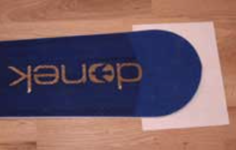
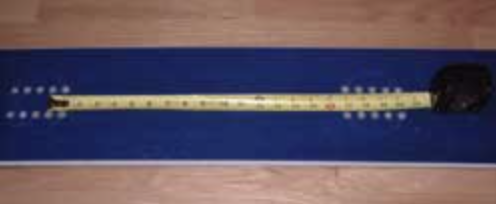
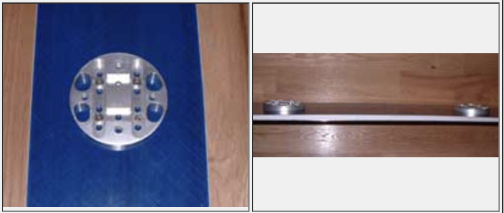
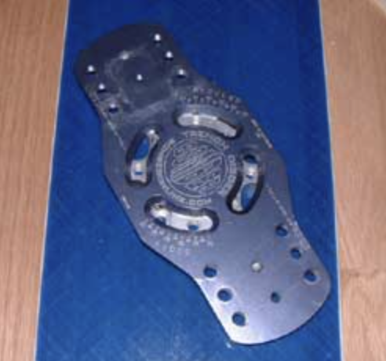
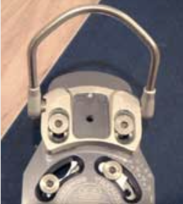
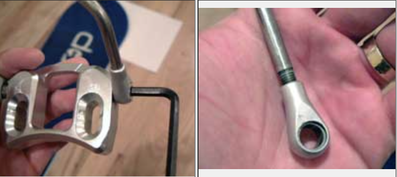
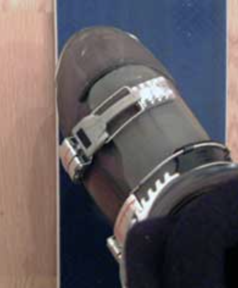
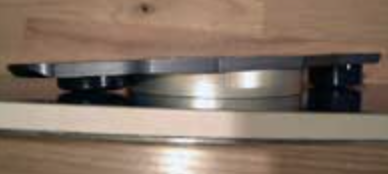
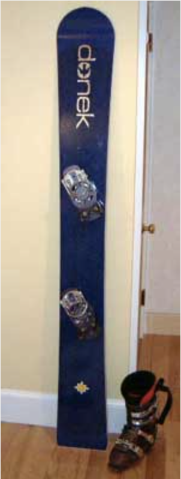

# How to Setup Your Plate Bindings

by Jack Michaud

Mounting your bindings is serious business. A poor setup can ruin your day, discourage and confuse you, and prevent you from progressing as a carver. A proper setup can make carving easier and more comfortable, and can unlock your total carving potential. With all the possible configurations, there are literally thousands of ways to get it wrong. But by following these instructions, the process becomes easier by elimination. It is well worth spending the time to get it near perfect the first time you set up each new board you buy, then minor adjustments can be made quickly when you feel the need for fine tuning. Or if you feel like your current setup isn't quite right or is holding you back, you might want to take everything apart and start from scratch. Let's go.

### Step 1: Determine the running length of your board.

The running length (sometimes used synonymously with effective edge length) is the length of your board actually in contact with the snow when you are riding it. Burton and some others differentiate between effective edge and running lengths by saying that the running length is the overall length minus nose length minus tail length, and that effective edge is the actual length of the curve of the sidecut, which will generally be a few centimeters longer. We will talk about running length here. This is usually a published or otherwise known number, but you need to know where it is located on your board.

On many boards, it is easy to see the running length by noticing the change from sidewall materal to nose and tail filler material. If you can't see this, or want to be extra sure, you can put your board on a smooth flat surface and slide a piece of paper under the nose and tail and see where it stops. Measure the length between these points.

### Step 2: Determine the location of your inserts along the running length, and decide where you want to stand.

Some boards have a reference stance marked right on the topsheet that tells you the width and the setback of the manufacturer's recommended stance. Some boards are built with their inserts centered on the running length, others use setback; they locate them 1" or so behind center.

It is obvious on this Donek 186GS that the middle sets of holes on each foot are the "reference" holes, or the intended starting point. I say this is obvious because manufacturers try to provide maximum options with their insert placement. The reference stance would not be the narrowest or the widest sets of holes. The middle holes are 19.25" apart. The midpoint of the distance between them is 33.5" back from the start of the running length at the nose, meaning they are centered over the 67" running length. (Excuse the English approximations, Donek probably uses the metric system along with the rest of the modern civilized world.)

Your board's sidecut reaches its apex at the center of the running length. The reason some boards have setback is so that when you lean forward, your center of gravity will be over the apex of the sidecut or just in front of it. If your board feels heavy turning or unresponsive, you may wish to experiment with centering your bindings on the center of the running length, or even slightly forward. That's yet another beauty of snowboards... we don't have to drill. Play around!

### Step 3: Decide your stance width.

Your stance width is up to you, not some factory. A good rule of thumb is shoulder width if you prefer to stand flat, but if you use lifts/cants, you can comfortably widen your stance a couple inches or so. A wider stance will improve balance and mobility, and therefore your carving, and is highly recommended. The more toe lift on the front foot and heel lift on the back foot you use, the wider you can go, but of course there are realistic limits. If you set your feet too far away from the center of the board, this may result in too much board length between your feet than in front or behind. You also do not want a stance so wide that it actually limits your mobility.

Some snowboards are built with constantly varying thickness. Many are built with a "deck": a length in the middle of the board with constant thickness. If your board has a deck, setting your bindings on the limits of this deck could have adverse effects on the flex pattern of the board.

Here I am using the center holes on the 3-degree Bomber discs in conjunction with the reference holes on the board, to achieve a 19.25" stance width, centered on the running length. If you are using two cant/lift discs, be sure to mount them such that they slope towards each other. Don't go for the sprinter's starting blocks effect! If you are using one cant/lift disc and one flat, experiment to see if it feels better to have the sloping disc under the back foot or the front foot. In either case, be sure to have the cant/lift disc sloping towards the waist of the board.

When deciding stance width, keep in mind that standing in your boots, clipped into your board on your living room floor is a lot less comfortable than when you are actually out on the hill riding. Don't ask me why that is, but it's true. Don't be afraid to go wide; the days of 16" or 17" stances for average height riders are long gone.

When you are screwing the discs to the board, take a spare tire approach and screw the bolts in diagonal order. Moderately tighten all the bolts first, then fully tighten in the same order. Hand tighten only! Using power tools to install your bindings can wreck your board. With a power screwdriver, it is much harder to feel when you are cross threading a bolt. With only four inserts available per foot (three for Burton), you can't afford to strip even one. Also, a power driver may over-torque your inserts, causing them to spin inside the board, or to crush the core. Quality manufacturers take precautions against this with reinforcement, but you still don't want to risk it, unless you are a seasoned pro with power tools. Before you attach the baseplates to the discs, check the disc bolts for tightness.

### Step 4: Size your bindings to your boots.

Sizing is most easily done with the bindings mounted to the board, but don't bother screwing them down tightly, as you need to adjust angles next. Your boots should be centered over the length of the binding baseplate. This aligns your boots for optimum edge clearance and comfort. If you are as sensitive as the princess and the pea, and you have a lot of free time on your hands, you may wish to experiment with "bias": aligning the boot behind center on the front binding, and ahead of center on the rear binding, or vice versa depending on preference.

You want to size the bindings such that your boots cannot rattle, roll side to side, or lift upwards when fully locked in the binding. On standard (non-step-in) bindings, clamping the toe lever down should be somewhat of an effort, but not requiring two hands. You don't want to have to ask a friend to clamp or release your bindings for you, because you want to be able to get in and out of them on your own. In addition, the binding shouldn't exert so much compressive force on the boot as to cause it to warp or buckle. After the toe lever is clipped, adjust the lever bolt (set screw) to ensure complete lockdown. On step-in bindings, you will probably need to micro-adjust the sizing until the heel pins have just enough room to fully insert into the holes without any play.

Bomber baseplates provide three sets of mounting holes for each toe/heel pad, and each toe/heel pad has channels with four mounting positions. If that isn't fine enough sizing, the bail lugs on the sides of the pads are threaded on to the bails for finer adjustment. Remove the lugs from the pads, and thread/unthread them to slightly increase or decrease bail length. Be sure to turn each pair of lugs an equal number of times. Thread them all the way in, then count the number or turns or half-turns out for each. If you start to see the threads on the bail, you have gone too far.

### Step 5: Determine the correct angles

The "correct" angles at which to mount your bindings on your board are those that keep your toes and heels as close to the edge of the board without hanging over. Boot overhang is a real drag, pun intended. Conversely, having your bindings angled too much, such that your toes and heels are significantly far away from the edges towards the middle of the deck, reduces your leverage and will make the board less maneuverable, and your carves less powerful.

To see if you have overhang, clip your left boot into your left binding and your right boot into your right binding, and put the board flat on the floor. Stand over your board and sight straight down at each toe and heel. Adjust your angles so that no part of the boot protrudes beyond the edge of the board. It's amazing just how high you can tilt your board in a carve, and how deeply it slices into the snow. Any boot overhang can cause drag and blow your carve. On standard bindings, if your binding toe bails stick out a little, that's okay, since they are much higher off the board, and have space between your boot for snow to pass through.

Notice that this technique will often result in parallel binding angles. This is a good place to start, and you can fine tune from here. If you are somewhat duck-footed or pigeon-toed, a three to five degree difference in angles is fine. Unless you have serious skeletal issues, setting binding angles with more than five degrees of difference will sacrifice lower body unity and strength, as your knees will be fighting each other. If this technique results in binding angles less than 50 degrees, you should consider a different, more narrow board for advanced race-style carving.

At this point, if you use Bomber bindings, you need to install the bumpers before you fix the plates to the discs at your chosen angles. There are two possible mounting positions for each bumper. Choose the one that has the bumper just touching the topsheet of the board when the board is flat. This may result in the bumper being somewhat compressed.

When you're done, your bindings will appear to be further back on the board than they really are. This is an illusion caused by the longer length of the upturned nose compared to the short, almost non-existent tail. Trust that your measurements have you standing in the right place. When you are satisfied with everything, give all your accessible bolts one last check for tightness.

