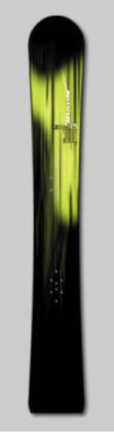
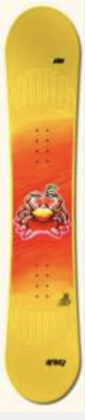
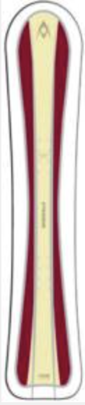
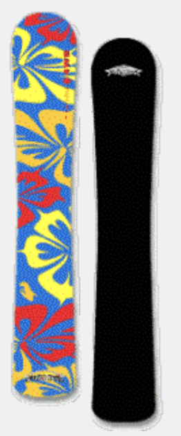
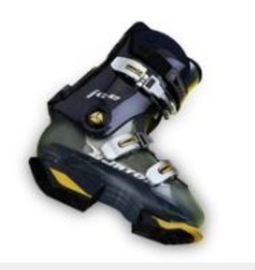

# Snowboarding Equipment: Soft, Medium, or Hard?

By Jack Michaud

1999

As snowboarders and the sport of snowboarding itself mature and grow older, more and more people of all ages can be seen ripping it up and having lots of fun on snowboards. Consequently, more people of all ages are more likely to consider taking up snowboarding as they see their peers enjoying themselves so much. The sport is no longer a circus side show practiced only by fearless adolescents.

However, one aspect of snowboarding that continues to be commonly overlooked is alpine riding. Alpine snowboarders enjoy perfecting the skills of making clean turns and crisp carves while mainly keeping their snowboards on the ground. Until just a few years ago, there was a stigma attached to alpine snowboarding due to the slim selection of unforgiving equipment, as well as the fact that alpine riding most closely resembles snowboarding’s skiing ancestry. For many, the attraction to snowboarding was the freedom from plastic boots, as well as a flair of rebelliousness associated with doing something different.

> **Race boards like Burton’s Factory- Prime are great for high-speed precision carving… but little else.**

Today, with a broad range of alpine snowboarding products available, alpine snowboarding has much more to offer both crossover skiers as well as snowboarders looking for a new challenge.

Until recently, being an alpine snowboarder meant using racing equipment or slightly watered down versions thereof that were less than accommodating to anyone interested in snowboarding slower than Mach-1. Now there are new breeds of boards, boots and bindings that fill the gap between the soft-boot/soft-board freestyle equipment and the high-end race equipment. The spectrum of snowboarding has never been so complete.

Do you or would you like to spend a lot of time riding the half-pipe, riding “fakie” (as in backwards, a.k.a. “switch”), or doing aerial tricks and spins? If not, then why bother with a freestyle snowboard? These boards typically have a softer flex and large upturned nose and tail that will inhibit your ability to gain proficiency in making clean carves at good speed. If you loathe the idea of stepping back into hardboots, and you are fortunate enough to ride a lot of powder, then a freeride board may be in order. These are generally similar in shape to their freestyle cousins, but with slightly stiffer flex and a bias towards riding in the forward direction. Although these are the most popular snowboards on the market, in truth their features provide little benefit for riders whose main interest is simply cruising about on packed snow.

> **Freestyle boards are fun and easy to use at first, but don’t put enough board on the ground for higher speed cruising and carving.**

A new style of snowboard that most snowboarders realistically should consider using is a “boardercross” snowboard. These are designed to be used with either soft or hard boots and have a shape suited to true all-mountain use. Derived from motocross, boardercross is a competition that tests rider’s skills at almost every snowboarding discipline. These boards have a nose adequate for powder, and an abbreviated, round, slightly upturned tail that is just big enough for varied terrain, quick turns and stints of fakie riding. The just-right nose and minimalist tail make for a longer edge length. This, combined with a more supportive flex pattern, provides better stability and grip for carving at higher speeds than traditional freeride boards, while retaining multi-functionality. Examples are the Burton Fusion, Volkl Spline, Morrow Indy, and F2 Eliminator.

> **“Boardercross” boards like the Volkl Spline combine all-terrain mobility with competent carving ability.**

If you prefer or desire the support and precision of hardboots and more carve-oriented boards, you don’t have to buy the full-on race gear. All-mountain carving boards such as the Burton Coil, Prior 4-Wheel-Drive, and F2 Breezer are built to provide strong carving ability while allowing the option of off-piste excursions. They include a fuller nose, a rounded tail and slightly wider width than their race-only brethren.

> **“All-Mountain Carvers” like the Prior 4WD provide carving prowess with mixed-terrain handling.**

Though the apparent comfort of soft boots is often enough to draw many to the sport, snowboarding-specific hardboots have come a long way, and in many cases are actually more comfortable than softboots. There is a full array of hard snowboard boots that provide adjustability in both front-to-back and side-to-side directions, allowing you to soften or stiffen the boots as you please. Many marques offer at least one snowboarding hardboot, while makers such as Raichle and Burton provide three or more offerings, including women’s sizing. A well-fitted hardboot has none of the pressure points or foot and lower leg fatigue associated with softboots. Add custom footbeds/orthotics and heat moldable liners and the interface between rider and board feels almost seamless.

> **Snowboard-specific hardboots offer specialized adjustability, support and comfort.**

All snowboarders should take the time to re-evaluate their snowboarding. If you realize you spend more time on the ground than in the air, or more time cruising the mountain than in the pipe/park, you should consider adding some alpine equipment to your arsenal. Granted, it is more common to start snowboarding on soft equipment. But people feeling the temptation to start snowboarding should identify just what it is that draws them to the sport and consider making alpine snowboarding a goal. In addition to the fact that carving a snowboard is an important skill for all snowboarders, the bottom line is that alpine snowboarding is downright fun and exhilarating. Give it a try!
