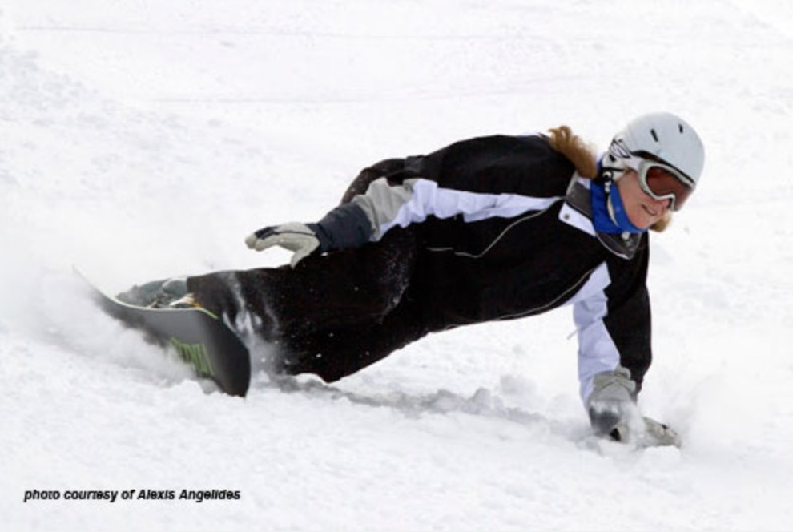

# Learn Safety and Safely

by Sean MacCaron

Choose the terrain that you feel the most comfortable on before trying any or all of these tips.

### The Toe Side Carve

A lot of people can find the toe side carve the most challenging as the asymmetric differences in our stance are now highlighted. Many people override the technicalities of this by just leaning into the turn. The results of this can be an unwanted increase in speed, more pressure on the board to deal with as well as being stuck on an edge in the turn without the ability to make adjustments.FOLLOW YOUR FEET!

Stand across the hill on a heel edge. Sort out your stance, feel even weight on both feet, both knees bent (equally), hands in a comfortable position to aid balance and of course looking in the direction of travel. Looking down you will notice that your feet are angled forward. Your body, or the center of mass, is going to follow the direction that your feet are pointing. Sounds simple! How do we do it? The first thing to do is to stand up slowly. This extension move releases the heel edge from its grip on the snow and the board starts to slide nose first into the fall line (down the hill). To prevent the board from running out of control down the hill. You the rider need to make the board change onto the toe edge. This is done by flexing or bending the knees towards the toes on both feet at the same time. The description of what's happening now is that the body or c.o.m. is moving forward and across the board at the same time. The board has changed edges and needs a certain amount of pressure to aid the carve. This is done by continually flexing through the ankles knees and last of all the hips. The feeling now is that all the pressures are coming from the body to the toe edge and from the board to the body. If the feeling is that one leg is working more than the other, it is time to stop and reassess your stance. If the exercise is done properly then you should see almost a J shaped carve on the snow. Remember to stand up slowly towards the end of the carve so as to finish standing and balanced. After trying several of these it is time to link them with the already practiced heel side turn.

If you are noticing a difference in the turn size and shape between the heel and the toe it is OK! What you now have to do is to find the right slope and practice before you change slopes.

1. STANCE CHECK
2. STAND UP SLOWLY
3. LOOK IN THE DIRECTION YOUR FEET ARE POINTING
4. SLOWLY FLEX ONTO THE TOE EDGE
5. FEEL THE CARVE HAPPEN
6. CHECK THE TRACK
7. TRY IT LOTS MORE TIMES UNTIL IT IS PERFECT

A GOOD ALTERNATE FOCUS IS TO TRY AND KEEP YOUR CHEST UP AND OVER YOUR FEET. Safety First always look up before attempting these drills do not test your new found skills by trying to slalom in and out of people. There are a lot of other people out there trying to practice too!

### Stance Revisited

Now that we have broken down the two turns we need to link them. This will ensure we are no longer losing huge amounts of speed between the heel and toe turns. Before we jump in at the deep end we need to give ourselves a stance reminder. We need to maintain even weight on both feet at all times. If we get thrown off balance we have a reference point to return to, TWO FEET!
When we stand in our Alpine Stance, a nice easy focus after two feet is the height we stand. This is best described as a mid-stance, meaning we have the ability to move up or down, always passing through that mid-stance area. This natural flexed shape does not require a great deal of strength or muscle power and should be comfortable. It is often compared with a spring loaded gear shift in a car. Whatever happens it always passes through neutral. (Our stance is Neutral) If for some reason it never makes it to the gear it wants, the car just slows down and coasts in neutral until a gear is selected. In comparison to the Rider that means returning to the mid-stance and getting it together before the next edge change. We are in a stiff plastic boot so it may need a little more effort initially to bend our ankles first, before the other joints actually kick in. That is the area of concern in most hard boot riders. An easy exercise to practice the ankle bending in your stance is a nice easy traverse on friendly terrain, feeling the shins squashing against the boot, then easing off. All this practiced on the toe edge.

Stance again

1. Even weight on both feet
2. Both knees bent
3. Hands out for balance (forward and level)
4. Looking in the direction of travel
5. Resting in the boots
6. Keep the ankles loose and flexy!

### Chatter

OK here's the scoop. A few days under the belt on the board things are coming along quite nicely. On some pitches however the board chatters! You have slowed it down and going slow seems OK. With the addition of speed the toe seems OK and the heel wobbles what is going on?

Revelation time! You are standing still. You have stopped extending or flexing at the right times. All is not lost. What is needed now is a fancy thing called timing. Your timing is missing. This means that when you are coming to the end of the turn there is no movement left in the legs. We are either leaning or sitting on the back of the board or trying to feel a really strong muscular stance. Unfortunately this means we are static. To fix the chatter at the end of the turn you must slow down the flexion and extension side of things. Make it last throughout the turn, if it takes you two seconds to stand up it needs to take you two seconds to bend down. When it all goes according to plan We end up with symmetrical turns and of course no chatter! As always, choose the right terrain, think safety and above all enjoy yourself. If it isn't working, take a break. Think about your stance first and slowly build up again to those symmetrical carves.

Thanks for the attention,

Go Carve!
Sean MacCarron
