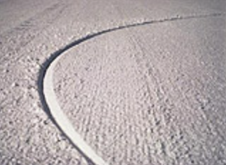

# So You Want To Try Alpine Snowboarding?

By Jack Michaud

Let's be honest, getting into hardboot alpine snowboarding is going to take some effort and determination on your part. That's not to say that it's much more difficult than softboot snowboarding, it's just that there are scant few retailers or rental shops to help you get going with equipment. Such is the price of pursuing a fringe sport. So what do you do? You certainly don't want to drop major coin on a new board, boots, and bindings just to see if you like it. The following steps will help you experiment with and ease into alpine snowboarding gradually.

First things first, if you've never snowboarded before, ~~continue here~~.

If you do know how to snowboard and have been riding a softboot freeride/freestyle setup, the first step towards alpine snowboarding before you buy or rent anything is to make sure you can carve on your current gear. "Carving" is the act of making a cleanly sliced turn without any sliding where your edge does all the work. The nose and tail of your board pass through the same points in the snow, and there is no steering with the feet. If you can do this, you're well on your way to enjoying a hardboot setup. A good test is whether or not you can change edges and start carving your next turn before your board points downhill. That is, can you carve your downhill edge? If you need some work on this, try practicing the Norm until you feel confident carving your soft gear.

Next, you need to find some alpine equipment to try. If an available resort or retailer rents boards boots and bindings, then you're all set, just rent the gear and take a lesson from a behardbooted instructor. But chances are very good that your resort or retailer doesn't have the right size board or boots, or even better that they don't even know what an alpine snowboard and hardboots look like. In this case, you have two possibilities: borrow the equipment from a friend, or start buying it yourself.

Fear not, you don't have to buy everything all at once. Bare minimum, you are going to need some hardboots and bindings. If you have ski boots already you can use them, but if they're super stiff racing boots, they may be a hinderence. Otherwise, retailers who sell or used to sell alpine gear usually have leftover inventory they want to unload for cheap. Look for snowboarding specific hardboots and plate bindings. If snowboard hardboots can't be found, you can look for recreational ski boots. If you can't find anything locally, it's the Bomber Store to the rescue. If you want to be really economical, buy used. Don't be afraid to buy bindings that say "race" on the box, you want sturdy bindings.

You don't have to buy an alpine board yet; see if you can get some carves to happen in hardboots on your existing snowboard. Mount the plate bindings on your deck such that the toes and heels of your boots don't protrude beyond the edges of the board. Click here for help on mounting plate bindings. Practice "the Norm" again, and get yourself carving in your hardboots. Ride your board with your hardboots until you feel your carving abilities are beginning to exceed the capabilities of your board. This may not take very much time, maybe a few weekends, maybe a day. Or if your freeride deck is relatively stiff and high quality, you may be able to carve it like this as long as you want. But sooner or later, you're going to want to step up to an alpine board.

When it comes time to select an alpine snowboard, again you can look for leftover inventory or buy used, if you want to stick to a reasonable budget. Look for a board that comes up to around your chin or your nose to start out. For your first alpine deck, a "freecarve" board is a good choice, or an all-mountain alpine snowboard if you want a better board to ride off-piste, bumps, and powder in addition to the groomers. A used race board can also be a good choice, as it will be "broken-in" for you. Just keep in mind that the racier the shape, the less easy it will be to skid the board when you need to.

Your first day on an alpine snowboard will probably feel a bit awkward, as you will probably be trying to use stance angles steeper than you've ever tried before. Just remember that this is a new animal, and try to relax. Things will be much easier if you don't try to muscle your equipment around, and try to go with the flow. Be patient. Don't rule out taking a lesson, in fact, it is highly recommended. It is well worth the extra price of a private or semi-private with an accomplished instructor. Make sure you explain to the ski-school that you want an instructor who teaches hardboot carving. If you want to give it a try yourself, or if a carving instructor isn't available, start out on a nice moderate green-circle slope and get a feel for the new setup. Try "the Norm" again, and then try the Norm Part II.

Pretty soon, you should find yourself linking carve after carve, leaving thin 'C' shaped tracks in the snow, and leaning further and further against the g-force of each turn. Congratulations, you're now a carver!

